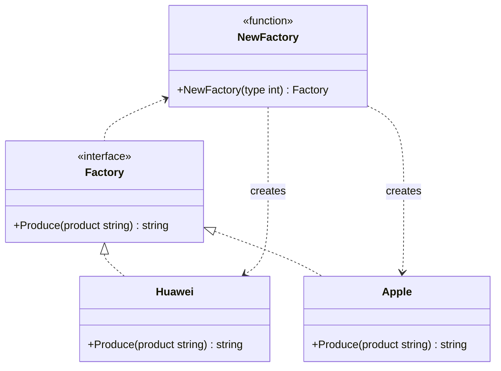

# 简单工厂模式（Simple Factory）
简单工厂模式提供一个创建对象实例的功能，而无需关心其具体实现。被创建的实例通常都具有共同的父类。

## 主要解决的问题
- 如何封装对象的创建过程
- 如何解耦对象的创建和使用
- 如何实现创建逻辑的集中管理
- 如何隐藏对象的具体实现

## 应用实例
1. Java的Calendar.getInstance()
2. Spring的BeanFactory
3. 数据库连接工厂
4. GUI组件创建

## 使用场景
1. 对象创建
   - 数据库连接
   - 日志记录器
   - 配置对象
2. 系统组件
   - GUI控件
   - 驱动程序
   - 协议处理器
3. 策略封装
   - 算法选择
   - 服务提供者
   - 格式解析器
4. 平台适配
   - 跨平台组件
   - 设备适配
   - 协议转换

## 优缺点
### 优点
1. 封装性好
   - 隐藏创建细节
   - 实现简单
2. 代码集中
   - 创建逻辑统一
   - 便于维护
3. 客户端简单
   - 使用方便
   - 职责单一

### 缺点
1. 职责过重
   - 工厂类集中度高
   - 代码复杂度增加
2. 扩展困难
   - 违反开闭原则
   - 修改工厂类
3. 维护成本
   - 测试困难
   - 依赖关系强

在这个 simplefactory 包中只有API 接口和 NewAPI 函数为包外可见，封装了实现细节。

## 代码实现

```golang
package designpattern

import "fmt"

type Factory interface {
	Produce(product string) string
}

type Huawei struct{}

func (*Huawei) Produce(product string) string {
	return fmt.Sprintf("hi %s", product)
}

type Apple struct{}

func (*Apple) Produce(product string) string {
	return fmt.Sprintf("hi %s", product)
}

func NewFactory(factoryType int) Factory {
	if factoryType == 1 {
		return &Huawei{}
	} else if factoryType == 2 {
		return &Apple{}
	}
	return nil
}
```

## 使用示例

```golang
func main() {
    // 创建华为工厂
    huaweiFactory := NewFactory(1)
    fmt.Println(huaweiFactory.Produce("phone"))  // 输出: hi phone

    // 创建苹果工厂
    appleFactory := NewFactory(2)
    fmt.Println(appleFactory.Produce("iPhone"))  // 输出: hi iPhone
}
```

## 类图


## 说明
1. 简单工厂的主要角色：
   - Factory（工厂）：负责创建所有实例的内部逻辑
   - Product（抽象产品）：所有产品的父类
   - ConcreteProduct（具体产品）：创建目标类
2. 实现要点：
   - 工厂方法的设计
   - 产品接口的抽象
   - 创建逻辑的封装
3. 设计考虑：
   - 是否需要缓存实例
   - 是否需要参数校验
   - 是否需要错误处理
4. 相关模式：
   - 工厂方法：更灵活的创建
   - 抽象工厂：产品族创建
   - 单例模式：工厂实例