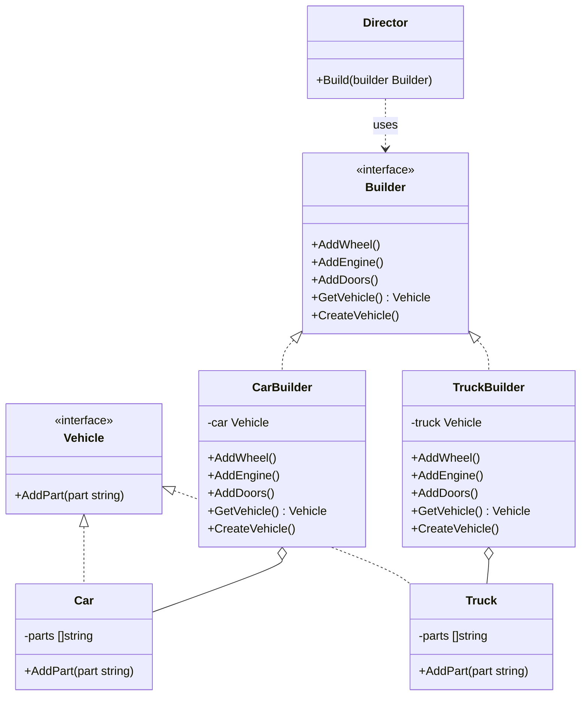

# 建造者模式（Builder）
建造者模式将一个复杂对象的构建与它的表示分离，使得同样的构建过程可以创建不同的表示。这种模式属于创建型模式。

## 主要解决的问题
- 如何分离复杂对象的构建和表示
- 如何控制复杂对象的构建过程
- 如何处理可选参数过多的问题
- 如何保证构建的一致性

## 应用实例
1. StringBuilder的实现
2. Protobuf的消息构建
3. SQL查询构建器
4. GUI构建器

## 使用场景
1. 对象构建
   - 复杂对象创建
   - 参数配置
   - 对象组装
2. 文档生成
   - HTML构建
   - XML生成
   - JSON构建
3. 数据转换
   - 数据格式化
   - 协议转换
   - 消息组装
4. 界面构建
   - 表单生成
   - 页面布局
   - 控件组装

## 优缺点
### 优点
1. 封装性好
   - 构建过程隐藏
   - 细节不可见
2. 扩展性强
   - 新建造者方便
   - 产品表示分离
3. 控制细粒度
   - 步骤精细控制
   - 顺序灵活调整

### 缺点
1. 产品组成部分
   - 产品必须有共同点
   - 范围需要约束
2. 构建器膨胀
   - 对象种类增多
   - 系统复杂度增加
3. 参数依赖
   - 参数顺序固定
   - 配置项增多

## 代码实现

```golang
package designpattern

// Builder 是生成器接口
type Builder interface {
	AddWheel()
	AddEngine()
	AddDoors()
	GetVehicle() Vehicle
	CreateVehicle()
}

// Director 是指挥者
type Director struct{}

// Build 使用生成器构建
func (d *Director) Build(builder Builder) {
	builder.CreateVehicle()
	builder.AddWheel()
	builder.AddEngine()
	builder.AddDoors()
}

// CarBuilder 是汽车生成器
type CarBuilder struct {
	car Vehicle
}

func (b *CarBuilder) AddWheel() {
	b.car.AddPart("Car Wheel")
}

func (b *CarBuilder) AddEngine() {
	b.car.AddPart("Car Engine")
}

func (b *CarBuilder) AddDoors() {
	b.car.AddPart("Car Doors")
}

func (b *CarBuilder) GetVehicle() Vehicle {
	return b.car
}

func (b *CarBuilder) CreateVehicle() {
	b.car = &Car{}
}

// TruckBuilder 是卡车生成器
type TruckBuilder struct {
	truck Vehicle
}

func (b *TruckBuilder) AddWheel() {
	b.truck.AddPart("Truck Engine")
}

func (b *TruckBuilder) AddEngine() {
	b.truck.AddPart("Truck Engine")
}

func (b *TruckBuilder) AddDoors() {
	b.truck.AddPart("Truck Doors")
}

func (b *TruckBuilder) GetVehicle() Vehicle {
	return b.truck
}

func (b *TruckBuilder) CreateVehicle() {
	b.truck = &Truck{}
}

// Vehicle 是车辆接口
type Vehicle interface {
	AddPart(part string)
}

// Car 是具体的汽车
type Car struct {
	parts []string
}

func (c *Car) AddPart(part string) {
	c.parts = append(c.parts, part)
}

// Truck 是具体的卡车
type Truck struct {
	parts []string
}

func (t *Truck) AddPart(part string) {
	t.parts = append(t.parts, part)
}
```

## 使用示例

```golang
func main() {
    director := &Director{}
    
    // 构建汽车
    carBuilder := &CarBuilder{}
    director.build(carBuilder)
    car := carBuilder.getVehicle()
    
    // 构建卡车
    truckBuilder := &TruckBuilder{}
    director.build(truckBuilder)
    truck := truckBuilder.getVehicle()
}
```

## 类图


## 说明
1. 建造者模式的主要角色：
   - Builder（抽象建造者）：规范产品的组建
   - ConcreteBuilder（具体建造者）：实现具体的构建过程
   - Director（指挥者）：控制构建过程
   - Product（产品）：被构建的复杂对象
2. 实现要点：
   - 构建步骤的设计
   - 构建顺序的控制
   - 产品表示的分离
3. 设计考虑：
   - 是否需要Director
   - 是否需要链式调用
   - 是否需要构建缓存
4. 相关模式：
   - 工厂模式：对象的创建
   - 组合模式：产品的组装
   - 模板方法：构建过程
