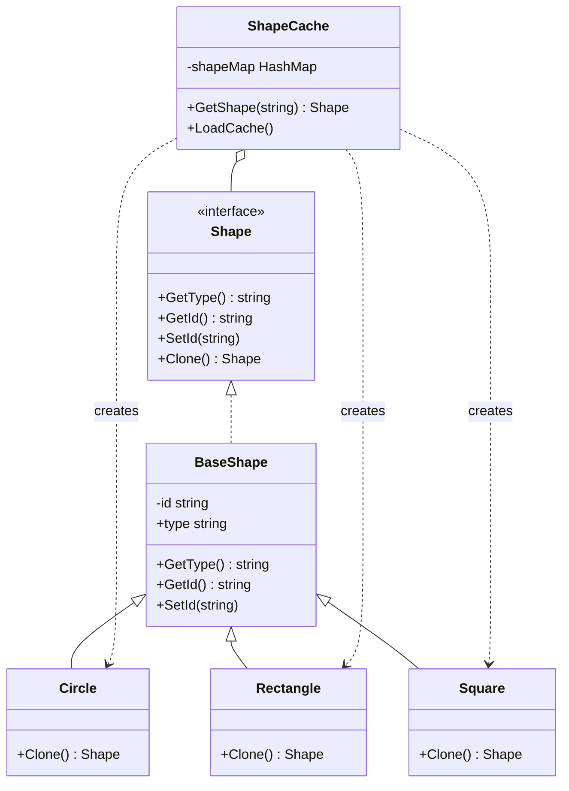

# 原型模式（Prototype）
原型模式用于创建重复的对象，同时又能保证性能。这种模式是实现了一个原型接口，该接口用于创建当前对象的克隆。

## 主要解决的问题
- 如何高效地创建重复对象
- 如何避免重复的初始化
- 如何保持对象一致性
- 如何实现对象的深度复制

## 应用实例
1. Object.clone()方法
2. 细胞分裂过程
3. 配置文件复制
4. 模板文档克隆

## 使用场景
1. 对象创建
   - 对象种类多
   - 创建成本高
   - 初始化复杂
2. 性能优化
   - 避免重复构造
   - 减少数据库访问
   - 提高响应速度
3. 数据处理
   - 数据备份
   - 历史记录
   - 状态保存
4. 对象复制
   - 模板复制
   - 配置克隆
   - 对象缓存

## 优缺点
### 优点
1. 性能提升
   - 减少创建开销
   - 避免重复初始化
2. 逻辑简单
   - 克隆代替创建
   - 实现简单
3. 内存友好
   - 共享内存
   - 减少资源占用

### 缺点
1. 克隆复杂性
   - 循环引用问题
   - 深浅拷贝选择
2. 对象一致性
   - 状态同步困难
   - 引用关系复杂
3. 实现成本
   - 每个类都要实现
   - 克隆逻辑维护

## 示例

这种模式是实现了一个原型接口，该接口用于创建当前对象的克隆。当直接创建对象的代价比较大时，则采用这种模式。例如，一个对象需要在一个高代价的数据库操作之后被创建。我们可以缓存该对象，在下一个请求时返回它的克隆，在需要的时候更新数据库，以此来减少数据库调用。


## 代码实现

```golang
package designpattern

// Shape 是形状接口
type Shape interface {
    GetType() string
    GetId() string
    SetId(id string)
    Clone() Shape
}

// BaseShape 提供基础实现
type BaseShape struct {
    id   string
    typ  string
}

func (s *BaseShape) GetType() string {
    return s.typ
}

func (s *BaseShape) GetId() string {
    return s.id
}

func (s *BaseShape) SetId(id string) {
    s.id = id
}

// Circle 实现
type Circle struct {
    BaseShape
}

func NewCircle() *Circle {
    return &Circle{
        BaseShape: BaseShape{typ: "Circle"},
    }
}

func (c *Circle) Clone() Shape {
    return &Circle{
        BaseShape: BaseShape{
            id:  c.id,
            typ: c.typ,
        },
    }
}

// Rectangle 实现
type Rectangle struct {
    BaseShape
}

func NewRectangle() *Rectangle {
    return &Rectangle{
        BaseShape: BaseShape{typ: "Rectangle"},
    }
}

func (r *Rectangle) Clone() Shape {
    return &Rectangle{
        BaseShape: BaseShape{
            id:  r.id,
            typ: r.typ,
        },
    }
}

// Square 实现
type Square struct {
    BaseShape
}

func NewSquare() *Square {
    return &Square{
        BaseShape: BaseShape{typ: "Square"},
    }
}

func (s *Square) Clone() Shape {
    return &Square{
        BaseShape: BaseShape{
            id:  s.id,
            typ: s.typ,
        },
    }
}

// ShapeCache 形状缓存管理器
type ShapeCache struct {
    shapeMap map[string]Shape
}

func NewShapeCache() *ShapeCache {
    return &ShapeCache{
        shapeMap: make(map[string]Shape),
    }
}

func (c *ShapeCache) GetShape(id string) Shape {
    cachedShape := c.shapeMap[id]
    return cachedShape.Clone()
}

func (c *ShapeCache) LoadCache() {
    circle := NewCircle()
    circle.SetId("1")
    c.shapeMap[circle.GetId()] = circle

    square := NewSquare()
    square.SetId("2")
    c.shapeMap[square.GetId()] = square

    rectangle := NewRectangle()
    rectangle.SetId("3")
    c.shapeMap[rectangle.GetId()] = rectangle
}
```

## 使用示例

```golang
func main() {
    cache := NewShapeCache()
    cache.LoadCache()

    // 克隆形状
    shape1 := cache.GetShape("1")
    shape2 := cache.GetShape("2")
    shape3 := cache.GetShape("3")
}
```

## 类图


## 说明
1. 原型模式的主要角色：
   - Prototype（原型接口）：声明克隆方法
   - ConcretePrototype（具体原型）：实现克隆方法
   - Client（客户端）：使用原型对象
   - Registry（原型注册表）：管理原型对象
2. 实现要点：
   - 克隆方法的实现
   - 深浅拷贝的选择
   - 对象状态的处理
3. 设计考虑：
   - 是否需要原型管理器
   - 是否需要深度克隆
   - 是否需要克隆缓存
4. 相关模式：
   - 工厂方法：对象的创建
   - 备忘录模式：状态的保存
   - 组合模式：对象的组织

