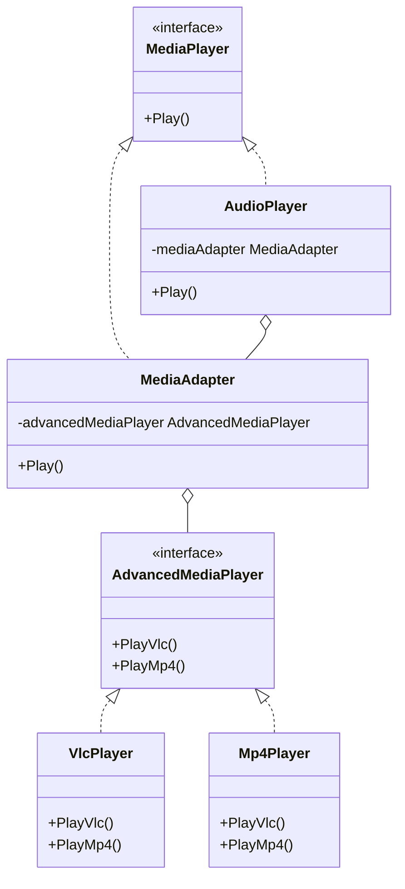

# 适配器模式（Adapter）
适配器模式将一个类的接口转换成客户希望的另外一个接口。适配器模式使得原本由于接口不兼容而不能一起工作的那些类可以一起工作。

## 主要解决的问题
- 如何让不兼容的接口协同工作
- 如何复用现有的类
- 如何整合第三方库
- 如何处理遗留系统

## 应用实例
1. Java IO的InputStreamReader
2. Spring的HandlerAdapter
3. 电源适配器
4. 数据格式转换器

## 使用场景
1. 接口转换
   - 新旧接口适配
   - 不同格式转换
   - 协议适配
2. 系统集成
   - 遗留系统整合
   - 第三方库适配
   - 跨平台开发
3. 数据处理
   - 数据格式转换
   - 数据结构适配
   - 编码转换
4. 兼容性处理
   - 版本兼容
   - 平台兼容
   - 设备兼容

## 优缺点
### 优点
1. 复用性好
   - 复用现有代码
   - 避免重复开发
2. 扩展性强
   - 易于添加适配器
   - 不修改原代码
3. 分离性好
   - 解耦客户和实现
   - 职责单一

### 缺点
1. 复杂度增加
   - 类数量增多
   - 理解难度增加
2. 可读性降低
   - 间接层增加
   - 调试困难
3. 性能损失
   - 中间转换
   - 额外开销

这种模式涉及到一个单一的类，该类负责加入独立的或不兼容的接口功能。举个真实的例子，读卡器是作为内存卡和笔记本之间的适配器。您将内存卡插入读卡器，再将读卡器插入笔记本，这样就可以通过笔记本来读取内存卡。

假设有一个音频播放器，它只能播放 MP3 文件。现在，我们需要播放 VLC 和 MP4 文件，可以通过创建一个适配器来实现：

目标接口：定义一个可以播放多种格式文件的音频播放器接口。
适配者类：现有的音频播放器，只能播放 MP3 文件。
适配器类：创建一个新的类，实现目标接口，并在内部使用适配者类来播放 MP3 文件，同时添加对 VLC 和 MP4 文件的支持。

## 示例
1. 不同数据格式的转换
2. 不同接口的兼容
3. 老系统接口适配
4. 第三方库的集成

## 代码实现

```golang
package designpattern

// MediaPlayer 是目标接口
type MediaPlayer interface {
    Play() 
}

// AdvancedMediaPlayer 是需要适配的高级播放器接口
type AdvancedMediaPlayer interface {
    PlayVlc()
    PlayMp4()
}

// VlcPlayer 实现高级播放器接口
type VlcPlayer struct{}

func (v *VlcPlayer) PlayVlc() {
    println("Playing vlc file")
}

func (v *VlcPlayer) PlayMp4() {
    // 不支持MP4
}

// Mp4Player 实现高级播放器接口
type Mp4Player struct{}

func (m *Mp4Player) PlayVlc() {
    // 不支持VLC
}

func (m *Mp4Player) PlayMp4() {
    println("Playing mp4 file")
}

// MediaAdapter 是适配器
type MediaAdapter struct {
    advancedMediaPlayer AdvancedMediaPlayer
}

func NewMediaAdapter(audioType string) *MediaAdapter {
    var advancedMediaPlayer AdvancedMediaPlayer
    if audioType == "vlc" {
        advancedMediaPlayer = &VlcPlayer{}
    } else if audioType == "mp4" {
        advancedMediaPlayer = &Mp4Player{}
    }
    return &MediaAdapter{advancedMediaPlayer}
}

func (m *MediaAdapter) Play() {
    switch m.advancedMediaPlayer.(type) {
    case *VlcPlayer:
        m.advancedMediaPlayer.PlayVlc()
    case *Mp4Player:
        m.advancedMediaPlayer.PlayMp4()
    }
}

// AudioPlayer 是实现了 MediaPlayer 接口的播放器
type AudioPlayer struct {
    mediaAdapter *MediaAdapter
}

func (a *AudioPlayer) Play() {
    if a.mediaAdapter != nil {
        a.mediaAdapter.Play()
    } else {
        println("Playing mp3 file")
    }
}

func NewAudioPlayer(audioType string) *AudioPlayer {
    var adapter *MediaAdapter
    if audioType == "vlc" || audioType == "mp4" {
        adapter = NewMediaAdapter(audioType)
    }
    return &AudioPlayer{adapter}
}
```

## 使用示例

```golang
func main() {
    // 播放 MP3
    audioPlayer := NewAudioPlayer("")
    audioPlayer.Play()

    // 播放 VLC
    vlcPlayer := NewAudioPlayer("vlc")
    vlcPlayer.Play()

    // 播放 MP4
    mp4Player := NewAudioPlayer("mp4")
    mp4Player.Play()
}
```

## 类图


## 说明
1. 适配器模式的主要角色：
   - Target（目标）：客户所期待的接口
   - Adaptee（适配者）：需要适配的类
   - Adapter（适配器）：转换接口的类
2. 实现要点：
   - 接口转换方式
   - 适配器类型选择
   - 转换逻辑封装
3. 设计考虑：
   - 是否需要双向适配
   - 是否需要缓存转换
   - 是否需要部分适配
4. 相关模式：
   - 装饰器模式：功能增强
   - 代理模式：访问控制
   - 外观模式：接口统一