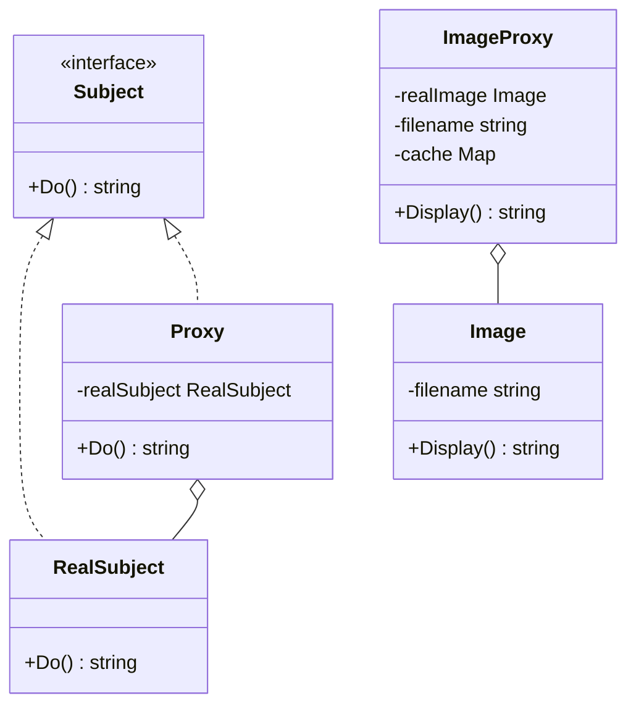

# 代理模式（Proxy）
代理模式为其他对象提供一种代理以控制对这个对象的访问。代理对象在客户端和目标对象之间起到中介的作用。

## 主要解决的问题
- 如何控制对对象的访问
- 如何在访问对象时添加额外的操作
- 如何对对象的访问进行权限控制
- 如何延迟对象的实例化

## 应用实例
1. Spring AOP中的动态代理
2. Nginx反向代理服务器
3. 数据库连接池代理
4. 远程方法调用（RPC）
5. 虚拟代理（延迟加载）
6. 保护代理（访问控制）
7. 缓存代理（结果缓存）

## 使用场景
1. 远程代理
   - 为远程对象提供本地代表
   - RPC调用中的客户端代理
2. 虚拟代理
   - 延迟加载大型对象
   - 图片预加载
3. 保护代理
   - 控制对原始对象的访问
   - 权限验证
4. 缓存代理
   - 为开销大的运算结果提供缓存
   - 网页缓存

## 优缺点
### 优点
1. 职责清晰
   - 真实对象只关注核心业务
   - 代理对象负责其他附加操作
2. 高扩展性
   - 不修改目标对象就可以扩展功能
   - 符合开闭原则
3. 智能化
   - 动态代理可以自动生成代理类
   - 可以实现AOP切面编程

### 缺点
1. 性能影响
   - 代理模式会造成请求处理速度变慢
   - 需要额外的代理类和对象
2. 系统复杂度
   - 增加了系统的复杂度
   - 需要额外的代理类设计
3. 代理嵌套
   - 多重代理会导致系统复杂
   - 调试排错较困难


## 代码实现

```golang
package designpattern

// Subject 定义代理和实际对象的共同接口
type Subject interface {
    Do() string
}

// RealSubject 是实际对象
type RealSubject struct{}

func (r *RealSubject) Do() string {
    return "RealSubject: doing something"
}

// Proxy 是代理对象
type Proxy struct {
    realSubject *RealSubject
}

func NewProxy() *Proxy {
    return &Proxy{}
}

func (p *Proxy) Do() string {
    // 在调用实际对象之前的处理
    if p.realSubject == nil {
        p.realSubject = &RealSubject{}
    }
    
    // 调用实际对象
    result := p.realSubject.Do()
    
    // 在调用实际对象之后的处理
    return "Proxy: " + result
}

// 实际应用示例：带缓存的代理
type ImageProxy struct {
    realImage *Image
    filename  string
    cache    map[string]string
}

type Image struct {
    filename string
}

func (i *Image) Display() string {
    return "Displaying " + i.filename
}

func NewImageProxy(filename string) *ImageProxy {
    return &ImageProxy{
        filename: filename,
        cache:    make(map[string]string),
    }
}

func (p *ImageProxy) Display() string {
    // 检查缓存
    if result, ok := p.cache[p.filename]; ok {
        return "Cached: " + result
    }
    
    // 延迟加载
    if p.realImage == nil {
        p.realImage = &Image{p.filename}
    }
    
    // 执行实际操作并缓存结果
    result := p.realImage.Display()
    p.cache[p.filename] = result
    
    return result
}
```

## 使用示例

```golang
func main() {
    // 基本代理示例
    proxy := NewProxy()
    result := proxy.Do()
    
    // 图片代理示例
    imageProxy := NewImageProxy("test.jpg")
    result1 := imageProxy.Display() // 第一次加载
    result2 := imageProxy.Display() // 使用缓存
}
```

## 类图


## 说明
1. 代理模式包含三个角色：
   - Subject（抽象主题）：定义代理和真实主题的共同接口
   - RealSubject（真实主题）：实现了抽象主题中的具体业务
   - Proxy（代理）：包含对真实主题的引用，可以在对真实主题的访问前后添加额外操作
2. 代理模式的主要用途：
   - 远程代理：为远程对象提供本地代表
   - 虚拟代理：延迟加载，优化系统性能
   - 保护代理：控制对原始对象的访问
   - 缓存代理：为开销大的运算结果提供暂时存储
3. 代理模式可以在不改变原有代码的情况下，添加新的功能
