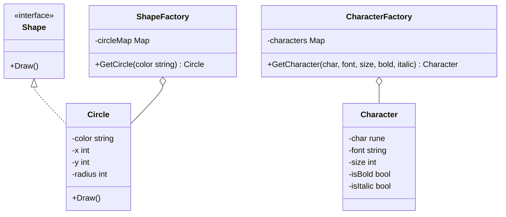

# 享元模式（Flyweight）
享元模式主要用于减少创建对象的数量，以减少内存占用和提高性能。这种类型的设计模式属于结构型模式，它提供了减少对象数量从而改善应用所需的对象结构的方式。

## 主要解决的问题
- 如何减少系统中对象的数量
- 如何降低内存占用
- 如何共享对象的公共部分
- 如何在共享的同时保持对象的独立性

## 应用实例
1. Java String常量池
2. 数据库连接池
3. 线程池技术
4. 浏览器的字体渲染
5. 文字编辑器中的字符对象
6. 游戏中的粒子系统
7. 缓存池
8. 共享的图形元素

## 使用场景
1. 系统中存在大量相似对象
   - 文字编辑器的字符对象
   - 游戏中的粒子系统
2. 细粒度的对象都具有一些共同的属性
   - 地图系统中的图标
   - UI系统中的图形元素
3. 对象的大部分状态都可以外部化
   - 棋牌游戏中的棋子
   - 文档中的格式化对象
4. 需要缓冲池的场景
   - 数据库连接池
   - 线程池

## 优缺点
### 优点
1. 减少内存使用
   - 共享相同的对象
   - 减少对象的创建
2. 提高性能
   - 减少对象创建时间
   - 减少GC压力
3. 提高程序的复用性
   - 共享对象易于管理
   - 减少代码冗余

### 缺点
1. 系统复杂度增加
   - 需要分离内部状态和外部状态
   - 需要额外的工厂类
2. 线程安全问题
   - 共享对象的线程安全难以保证
   - 需要额外的同步机制
3. 状态管理困难
   - 外部状态管理复杂
   - 状态改变可能影响所有共享对象

## 代码实现

```golang
package designpattern

// Shape 接口定义了所有形状的通用方法
type Shape interface {
    Draw()
}

// Circle 实现了 Shape 接口
type Circle struct {
    color string
    x     int
    y     int
    radius int
}

func (c *Circle) Draw() {
    fmt.Printf("Drawing Circle of color: %s at (%d,%d)\n", c.color, c.x, c.y)
}

// ShapeFactory 是享元工厂
type ShapeFactory struct {
    circleMap map[string]*Circle
}

func NewShapeFactory() *ShapeFactory {
    return &ShapeFactory{
        circleMap: make(map[string]*Circle),
    }
}

func (f *ShapeFactory) GetCircle(color string) *Circle {
    if circle, ok := f.circleMap[color]; ok {
        return circle
    }
    
    circle := &Circle{
        color: color,
    }
    f.circleMap[color] = circle
    return circle
}

// 实际应用示例：文字编辑器中的字符
type Character struct {
    char     rune
    font     string
    size     int
    isBold   bool
    isItalic bool
}

type CharacterFactory struct {
    characters map[string]*Character
}

func NewCharacterFactory() *CharacterFactory {
    return &CharacterFactory{
        characters: make(map[string]*Character),
    }
}

func (f *CharacterFactory) GetCharacter(char rune, font string, size int, bold, italic bool) *Character {
    key := fmt.Sprintf("%c-%s-%d-%v-%v", char, font, size, bold, italic)
    if c, ok := f.characters[key]; ok {
        return c
    }
    
    c := &Character{
        char:     char,
        font:     font,
        size:     size,
        isBold:   bold,
        isItalic: italic,
    }
    f.characters[key] = c
    return c
}
```

## 使用示例

```golang
func main() {
    // 形状工厂示例
    factory := NewShapeFactory()
    
    circle1 := factory.GetCircle("Red")
    circle1.x = 10
    circle1.y = 20
    circle1.Draw()
    
    circle2 := factory.GetCircle("Red")
    circle2.x = 30
    circle2.y = 40
    circle2.Draw()
    
    // 字符工厂示例
    charFactory := NewCharacterFactory()
    
    char1 := charFactory.GetCharacter('A', "Arial", 12, true, false)
    char2 := charFactory.GetCharacter('A', "Arial", 12, true, false)
    
    // char1 和 char2 是同一个对象的引用
    fmt.Println(char1 == char2) // true
}
```

## 类图


## 说明
1. 享元模式的主要角色：
   - Flyweight（享元）：定义共享接口
   - ConcreteFlyweight（具体享元）：实现共享接口
   - UnsharedConcreteFlyweight（非共享具体享元）：不需要共享的子类
   - FlyweightFactory（享元工厂）：创建和管理享元对象
2. 实现要点：
   - 内部状态和外部状态的分离
   - 享元对象的缓存管理
   - 线程安全的考虑
3. 设计考虑：
   - 是否所有对象都需要共享
   - 是否需要线程安全的实现
   - 缓存策略的选择
4. 相关模式：
   - 单例模式：确保享元工厂的唯一性
   - 组合模式：构建享元对象树
   - 策略模式：不同的对象获取策略
