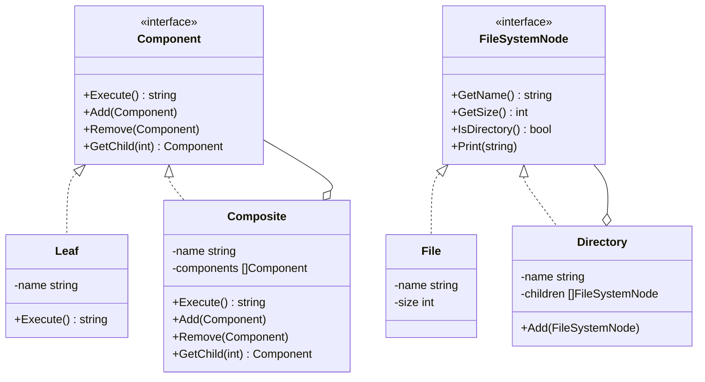

# 组合模式（Composite）
组合模式允许你将对象组合成树形结构来表现"整体/部分"层次结构，使得客户以一致的方式处理单个对象和对象的组合。

## 主要解决的问题
- 如何处理树形结构的问题
- 如何统一处理整体和部分
- 如何让客户端忽略组合对象和单个对象的差异
- 如何构建部分-整体层次的结构

## 应用实例
1. 文件系统的目录结构
2. 公司组织架构管理
3. GUI组件的容器和组件
4. XML/HTML的文档对象模型

## 使用场景
1. 文件系统
   - 文件和目录的管理
   - 目录树的遍历
2. 图形界面
   - 窗口和控件的管理
   - 布局容器的嵌套
3. 组织架构
   - 部门和员工管理
   - 权限系统设计
4. 菜单系统
   - 多级菜单
   - 导航结构

## 优缺点
### 优点
1. 简化客户端操作
   - 统一处理复杂和简单对象
   - 客户端无需区分对象类型
2. 易于扩展
   - 新增组合对象和叶子对象方便
   - 符合开闭原则
3. 层次结构清晰
   - 表示层次关系直观
   - 管理整体-部分关系方便

### 缺点
1. 限制性约束难实现
   - 很难限制组合中的组件类型
   - 运行时类型检查困难
2. 系统设计复杂
   - 需要精心设计接口
   - 可能需要额外的类型判断
3. 遍历性能
   - 树形结构遍历可能影响性能
   - 需要考虑遍历优化

## 代码实现

```golang
package designpattern

// Component 定义组件接口
type Component interface {
    Execute() string
    Add(Component)
    Remove(Component)
    GetChild(int) Component
}

// Leaf 叶子节点
type Leaf struct {
    name string
}

func NewLeaf(name string) *Leaf {
    return &Leaf{name: name}
}

func (l *Leaf) Execute() string {
    return l.name
}

func (l *Leaf) Add(Component)                {}
func (l *Leaf) Remove(Component)             {}
func (l *Leaf) GetChild(int) Component       { return nil }

// Composite 组合节点
type Composite struct {
    name       string
    components []Component
}

func NewComposite(name string) *Composite {
    return &Composite{
        name:       name,
        components: make([]Component, 0),
    }
}

func (c *Composite) Execute() string {
    result := c.name
    for _, comp := range c.components {
        result += " " + comp.Execute()
    }
    return result
}

func (c *Composite) Add(component Component) {
    c.components = append(c.components, component)
}

func (c *Composite) Remove(component Component) {
    for i, comp := range c.components {
        if comp == component {
            c.components = append(c.components[:i], c.components[i+1:]...)
            break
        }
    }
}

func (c *Composite) GetChild(index int) Component {
    if index < len(c.components) {
        return c.components[index]
    }
    return nil
}

// 实际应用示例：文件系统
type FileSystemNode interface {
    GetName() string
    GetSize() int
    IsDirectory() bool
    Print(prefix string)
}

type File struct {
    name string
    size int
}

func NewFile(name string, size int) *File {
    return &File{name: name, size: size}
}

func (f *File) GetName() string      { return f.name }
func (f *File) GetSize() int        { return f.size }
func (f *File) IsDirectory() bool   { return false }
func (f *File) Print(prefix string) { 
    fmt.Printf("%s- %s (%d bytes)\n", prefix, f.name, f.size) 
}

type Directory struct {
    name     string
    children []FileSystemNode
}

func NewDirectory(name string) *Directory {
    return &Directory{
        name:     name,
        children: make([]FileSystemNode, 0),
    }
}

func (d *Directory) Add(child FileSystemNode) {
    d.children = append(d.children, child)
}

func (d *Directory) GetName() string    { return d.name }
func (d *Directory) IsDirectory() bool { return true }

func (d *Directory) GetSize() int {
    total := 0
    for _, child := range d.children {
        total += child.GetSize()
    }
    return total
}

func (d *Directory) Print(prefix string) {
    fmt.Printf("%s+ %s\n", prefix, d.name)
    for _, child := range d.children {
        child.Print(prefix + "  ")
    }
}
```

## 使用示例

```golang
func main() {
    // 基本组合示例
    root := NewComposite("Root")
    branch1 := NewComposite("Branch1")
    branch2 := NewComposite("Branch2")
    leaf1 := NewLeaf("Leaf1")
    leaf2 := NewLeaf("Leaf2")
    
    root.Add(branch1)
    root.Add(branch2)
    branch1.Add(leaf1)
    branch2.Add(leaf2)
    
    fmt.Println(root.Execute())
    
    // 文件系统示例
    root := NewDirectory("root")
    docs := NewDirectory("docs")
    root.Add(docs)
    
    file1 := NewFile("file1.txt", 100)
    file2 := NewFile("file2.txt", 200)
    docs.Add(file1)
    docs.Add(file2)
    
    root.Print("")
}
```

## 类图


## 说明
1. 组合模式主要包含三个角色：
   - Component（组件）：定义组合中对象的通用接口
   - Leaf（叶子）：表示组合中的叶子节点对象
   - Composite（组合）：表示组合中的分支节点对象
2. 实现要点：
   - 统一的组件接口设计
   - 递归组合的实现
   - 组件生命周期管理
3. 设计考虑：
   - 是否需要父节点引用
   - 是否需要有序组合
   - 是否需要缓存机制
4. 相关模式：
   - 装饰器模式：扩展组件功能
   - 迭代器模式：遍历组合结构
   - 访问者模式：操作组合结构
