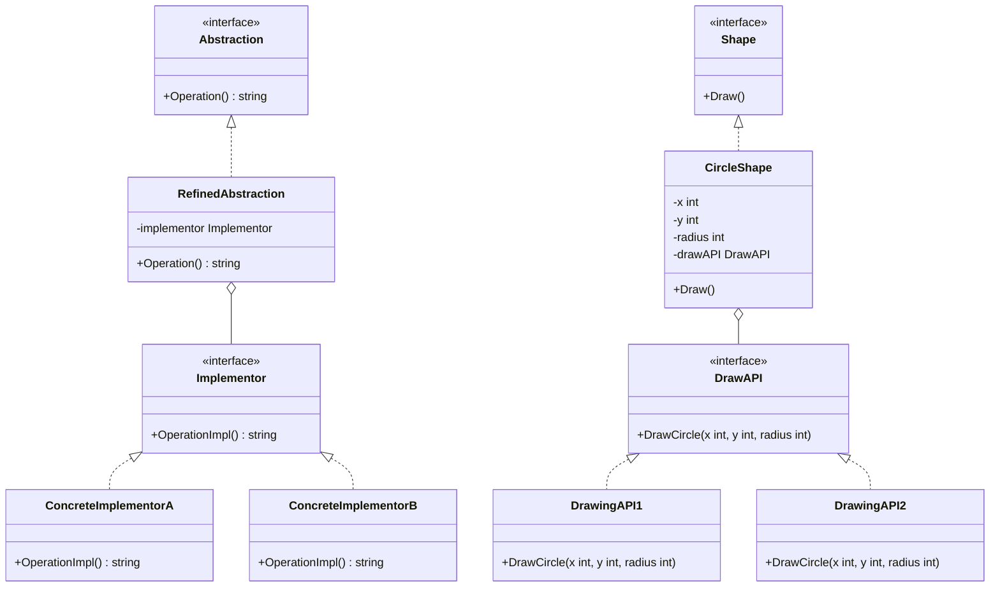

# 桥接模式（Bridge）
桥接模式是将抽象部分与实现部分分离，使它们都可以独立地变化。这种类型的设计模式属于结构型模式，它通过提供抽象化和实现化之间的桥接结构，来实现二者的解耦。

## 主要解决的问题
- 如何实现抽象和实现的分离
- 如何处理多维度变化的系统
- 如何避免继承带来的类爆炸
- 如何在运行时切换实现

## 应用实例
1. JDBC驱动程序
2. 跨平台GUI程序
3. 设备驱动程序
4. 游戏引擎渲染器

## 使用场景
1. 跨平台开发
   - 图形界面框架
   - 文件系统接口
   - 数据库访问
2. 设备驱动
   - 打印机驱动
   - 显示设备驱动
   - 输入设备驱动
3. 消息通信
   - 多协议支持
   - 多格式处理
   - 多渠道发送
4. 图形系统
   - 多种渲染引擎
   - 多种图形格式
   - 多种显示设备

## 优缺点
### 优点
1. 分离抽象与实现
   - 解耦合
   - 独立演化
2. 提高可扩展性
   - 易于添加新实现
   - 易于扩展新抽象
3. 实现细节对客户透明
   - 封装实现细节
   - 简化客户端代码

### 缺点
1. 增加复杂度
   - 需要正确识别系统维度
   - 需要设计额外的层次结构
2. 不容易理解
   - 抽象程度较高
   - 设计模式较难掌握
3. 性能损失
   - 间接调用带来开销
   - 系统结构变得复杂

## 代码实现

```golang
package designpattern

// Implementor 定义实现接口
type Implementor interface {
    OperationImpl() string
}

// ConcreteImplementorA 具体实现A
type ConcreteImplementorA struct{}

func (c *ConcreteImplementorA) OperationImpl() string {
    return "ConcreteImplementorA"
}

// ConcreteImplementorB 具体实现B
type ConcreteImplementorB struct{}

func (c *ConcreteImplementorB) OperationImpl() string {
    return "ConcreteImplementorB"
}

// Abstraction 定义抽象接口
type Abstraction interface {
    Operation() string
}

// RefinedAbstraction 扩展抽象接口
type RefinedAbstraction struct {
    implementor Implementor
}

func NewRefinedAbstraction(impl Implementor) *RefinedAbstraction {
    return &RefinedAbstraction{
        implementor: impl,
    }
}

func (r *RefinedAbstraction) Operation() string {
    return "RefinedAbstraction: " + r.implementor.OperationImpl()
}

// 实际应用示例：跨平台绘图
type DrawAPI interface {
    DrawCircle(x, y, radius int)
}

type DrawingAPI1 struct{}

func (d *DrawingAPI1) DrawCircle(x, y, radius int) {
    fmt.Printf("API1.circle at %d:%d radius %d\n", x, y, radius)
}

type DrawingAPI2 struct{}

func (d *DrawingAPI2) DrawCircle(x, y, radius int) {
    fmt.Printf("API2.circle at %d:%d radius %d\n", x, y, radius)
}

type Shape interface {
    Draw()
}

type CircleShape struct {
    x, y, radius int
    drawAPI      DrawAPI
}

func NewCircleShape(x, y, radius int, drawAPI DrawAPI) *CircleShape {
    return &CircleShape{
        x:       x,
        y:       y,
        radius:  radius,
        drawAPI: drawAPI,
    }
}

func (c *CircleShape) Draw() {
    c.drawAPI.DrawCircle(c.x, c.y, c.radius)
}
```

## 使用示例

```golang
func main() {
    // 基本示例
    implA := &ConcreteImplementorA{}
    implB := &ConcreteImplementorB{}
    
    abstractionA := NewRefinedAbstraction(implA)
    abstractionB := NewRefinedAbstraction(implB)
    
    fmt.Println(abstractionA.Operation())
    fmt.Println(abstractionB.Operation())
    
    // 绘图示例
    api1 := &DrawingAPI1{}
    api2 := &DrawingAPI2{}
    
    circle1 := NewCircleShape(1, 2, 3, api1)
    circle2 := NewCircleShape(5, 7, 11, api2)
    
    circle1.Draw()
    circle2.Draw()
}
```

## 类图


## 说明
1. 桥接模式的主要角色：
   - Abstraction（抽象类）：定义抽象类的接口
   - RefinedAbstraction（扩充抽象类）：扩展抽象类
   - Implementor（实现类接口）：定义实现类的接口
   - ConcreteImplementor（具体实现类）：实现实现类接口
2. 实现要点：
   - 抽象接口设计
   - 实现接口设计
   - 组合关系管理
3. 设计考虑：
   - 是否需要运行时更换实现
   - 是否需要支持多维度变化
   - 是否需要缓存实现对象
4. 相关模式：
   - 适配器模式：接口转换
   - 装饰器模式：功能增强
   - 抽象工厂：创建实现对象
