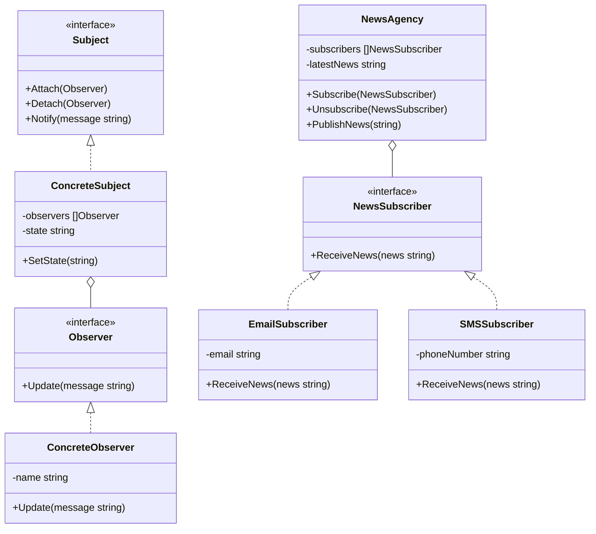

# 观察者模式（Observer）
观察者模式定义了一种一对多的依赖关系，让多个观察者对象同时监听某一个主题对象。这个主题对象在状态发生变化时，会通知所有观察者对象，使它们能够自动更新自己。

## 主要解决的问题
- 如何建立对象间的一对多的依赖关系
- 如何在保持松耦合的前提下实现对象间的通信
- 如何实现事件的发布-订阅机制
- 如何确保状态的一致性传播

## 应用实例
1. Java的事件处理机制
2. Vue的数据绑定
3. 消息队列系统
4. Node.js的EventEmitter

## 使用场景
1. 事件处理
   - GUI事件响应
   - 系统状态监控
   - 消息通知
2. 数据同步
   - 数据更新推送
   - 缓存同步
   - 状态同步
3. 业务解耦
   - 模块间通信
   - 插件系统
   - 日志记录
4. 响应式编程
   - 数据流处理
   - 实时数据更新
   - 异步任务处理

## 优缺点
### 优点
1. 松耦合
   - 观察者和主题互不依赖
   - 可以独立改变和复用
2. 支持广播通信
   - 一对多通信方便
   - 消息传播自动化
3. 符合开闭原则
   - 易于增加观察者
   - 不影响现有代码

### 缺点
1. 性能问题
   - 通知过程开销大
   - 可能触发循环调用
2. 依赖处理复杂
   - 观察者顺序不确定
   - 可能产生错误依赖
3. 内存泄漏风险
   - 观察者没有及时释放
   - 循环引用问题

## 代码实现

```golang
package designpattern

// Observer 定义观察者接口
type Observer interface {
    Update(message string)
}

// Subject 定义主题接口
type Subject interface {
    Attach(observer Observer)
    Detach(observer Observer)
    Notify(message string)
}

// ConcreteSubject 具体主题
type ConcreteSubject struct {
    observers []Observer
    state     string
}

func NewConcreteSubject() *ConcreteSubject {
    return &ConcreteSubject{
        observers: make([]Observer, 0),
    }
}

func (s *ConcreteSubject) Attach(observer Observer) {
    s.observers = append(s.observers, observer)
}

func (s *ConcreteSubject) Detach(observer Observer) {
    for i, obs := range s.observers {
        if obs == observer {
            s.observers = append(s.observers[:i], s.observers[i+1:]...)
            break
        }
    }
}

func (s *ConcreteSubject) Notify(message string) {
    for _, observer := range s.observers {
        observer.Update(message)
    }
}

func (s *ConcreteSubject) SetState(state string) {
    s.state = state
    s.Notify(state)
}

// ConcreteObserver 具体观察者
type ConcreteObserver struct {
    name string
}

func NewConcreteObserver(name string) *ConcreteObserver {
    return &ConcreteObserver{name: name}
}

func (o *ConcreteObserver) Update(message string) {
    fmt.Printf("Observer %s received: %s\n", o.name, message)
}

// 实际应用示例：新闻订阅系统
type NewsAgency struct {
    subscribers []NewsSubscriber
    latestNews  string
}

func NewNewsAgency() *NewsAgency {
    return &NewsAgency{
        subscribers: make([]NewsSubscriber, 0),
    }
}

func (n *NewsAgency) Subscribe(subscriber NewsSubscriber) {
    n.subscribers = append(n.subscribers, subscriber)
}

func (n *NewsAgency) Unsubscribe(subscriber NewsSubscriber) {
    for i, sub := range n.subscribers {
        if sub == subscriber {
            n.subscribers = append(n.subscribers[:i], n.subscribers[i+1:]...)
            break
        }
    }
}

func (n *NewsAgency) PublishNews(news string) {
    n.latestNews = news
    for _, subscriber := range n.subscribers {
        subscriber.ReceiveNews(news)
    }
}

type NewsSubscriber interface {
    ReceiveNews(news string)
}

type EmailSubscriber struct {
    email string
}

func NewEmailSubscriber(email string) *EmailSubscriber {
    return &EmailSubscriber{email: email}
}

func (s *EmailSubscriber) ReceiveNews(news string) {
    fmt.Printf("Sending news to %s: %s\n", s.email, news)
}

type SMSSubscriber struct {
    phoneNumber string
}

func NewSMSSubscriber(phoneNumber string) *SMSSubscriber {
    return &SMSSubscriber{phoneNumber: phoneNumber}
}

func (s *SMSSubscriber) ReceiveNews(news string) {
    fmt.Printf("Sending SMS to %s: %s\n", s.phoneNumber, news)
}
```

## 使用示例

```golang
func main() {
    // 基本示例
    subject := NewConcreteSubject()
    
    observer1 := NewConcreteObserver("Observer 1")
    observer2 := NewConcreteObserver("Observer 2")
    
    subject.Attach(observer1)
    subject.Attach(observer2)
    
    subject.SetState("New State!")
    
    // 新闻订阅示例
    newsAgency := NewNewsAgency()
    
    emailSub := NewEmailSubscriber("user@example.com")
    smsSub := NewSMSSubscriber("+1234567890")
    
    newsAgency.Subscribe(emailSub)
    newsAgency.Subscribe(smsSub)
    
    newsAgency.PublishNews("Breaking News: Go 2.0 Released!")
}
```

## 类图


## 说明
1. 观察者模式的主要角色：
   - Subject（主题）：定义观察者注册和通知接口
   - Observer（观察者）：定义状态更新接口
   - ConcreteSubject（具体主题）：实现主题接口
   - ConcreteObserver（具体观察者）：实现观察者接口
2. 实现要点：
   - 观察者的注册机制
   - 通知的触发机制
   - 状态的同步方式
3. 设计考虑：
   - 是否需要异步通知
   - 是否需要过滤通知
   - 是否需要撤销通知
4. 相关模式：
   - 中介者模式：不同的通信方式
   - 策略模式：不同的更新策略
   - 命令模式：封装通知请求
