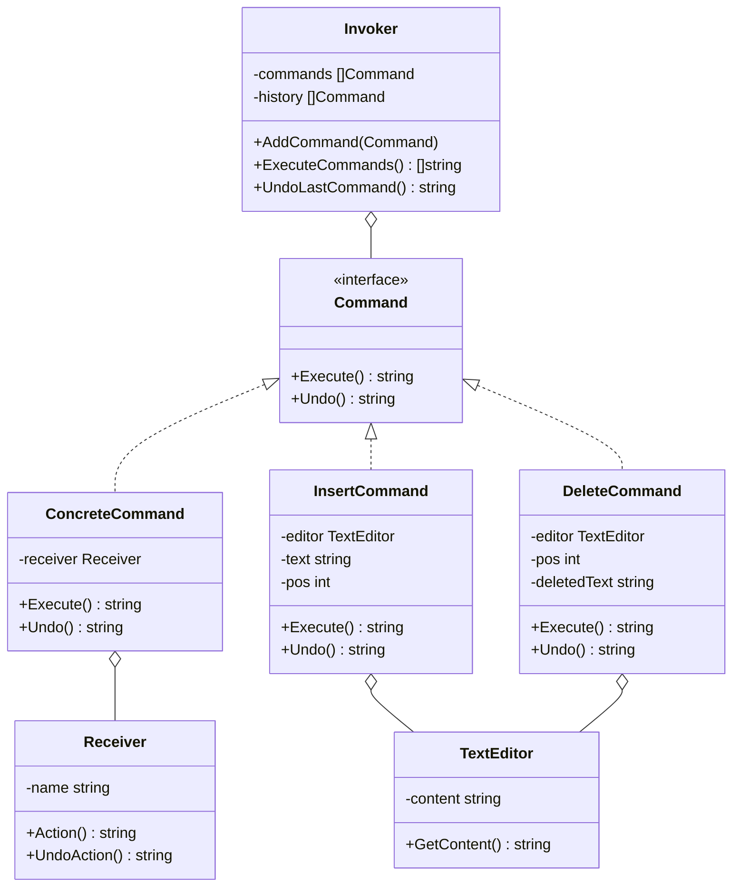

# 命令模式（Command）
命令模式将一个请求封装为一个对象，从而使你可用不同的请求对客户进行参数化，对请求排队或记录请求日志，以及支持可撤销的操作。

## 主要解决的问题
- 如何将请求发送者和接收者解耦
- 如何支持请求的排队和日志记录
- 如何实现可撤销操作
- 如何封装一系列动作或事务

## 应用实例
1. GUI按钮和菜单项的点击事件
2. 数据库事务管理
3. 文本编辑器的撤销重做
4. 命令行解释器

## 使用场景
1. 操作记录
   - 操作日志
   - 事务管理
   - 宏命令录制
2. 任务队列
   - 异步任务处理
   - 工作流管理
   - 批处理操作
3. 用户界面
   - 按钮点击
   - 菜单选择
   - 快捷键绑定
4. 系统控制
   - 远程调用
   - 系统命令
   - 脚本执行

## 优缺点
### 优点
1. 解耦请求和实现
   - 发送者和接收者分离
   - 易于扩展新命令
2. 容易组合命令
   - 支持宏命令
   - 支持组合操作
3. 扩展性好
   - 新增命令方便
   - 不影响已有代码

### 缺点
1. 类数量增加
   - 每个命令都需要一个类
   - 系统复杂度增加
2. 性能开销
   - 命令对象创建开销
   - 命令队列占用内存
3. 维护成本
   - 命令的版本控制
   - 撤销操作的实现复杂

## 代码实现

```golang
package designpattern

// Command 定义命令接口
type Command interface {
    Execute() string
    Undo() string
}

// Receiver 命令接收者
type Receiver struct {
    name string
}

func NewReceiver(name string) *Receiver {
    return &Receiver{name: name}
}

func (r *Receiver) Action() string {
    return fmt.Sprintf("Receiver %s is handling the request", r.name)
}

func (r *Receiver) UndoAction() string {
    return fmt.Sprintf("Receiver %s is undoing the request", r.name)
}

// ConcreteCommand 具体命令
type ConcreteCommand struct {
    receiver *Receiver
}

func NewConcreteCommand(receiver *Receiver) *ConcreteCommand {
    return &ConcreteCommand{receiver: receiver}
}

func (c *ConcreteCommand) Execute() string {
    return c.receiver.Action()
}

func (c *ConcreteCommand) Undo() string {
    return c.receiver.UndoAction()
}

// Invoker 命令调用者
type Invoker struct {
    commands []Command
    history  []Command
}

func NewInvoker() *Invoker {
    return &Invoker{
        commands: make([]Command, 0),
        history:  make([]Command, 0),
    }
}

func (i *Invoker) AddCommand(command Command) {
    i.commands = append(i.commands, command)
}

func (i *Invoker) ExecuteCommands() []string {
    var results []string
    for _, cmd := range i.commands {
        results = append(results, cmd.Execute())
        i.history = append(i.history, cmd)
    }
    i.commands = make([]Command, 0)
    return results
}

func (i *Invoker) UndoLastCommand() string {
    if len(i.history) == 0 {
        return "No commands to undo"
    }
    lastIndex := len(i.history) - 1
    lastCommand := i.history[lastIndex]
    i.history = i.history[:lastIndex]
    return lastCommand.Undo()
}

// 实际应用示例：文本编辑器
type TextEditor struct {
    content string
}

func NewTextEditor() *TextEditor {
    return &TextEditor{}
}

func (e *TextEditor) GetContent() string {
    return e.content
}

// InsertCommand 插入文本命令
type InsertCommand struct {
    editor *TextEditor
    text   string
    pos    int
}

func NewInsertCommand(editor *TextEditor, text string, pos int) *InsertCommand {
    return &InsertCommand{
        editor: editor,
        text:   text,
        pos:    pos,
    }
}

func (c *InsertCommand) Execute() string {
    if c.pos > len(c.editor.content) {
        c.editor.content += c.text
    } else {
        c.editor.content = c.editor.content[:c.pos] + c.text + c.editor.content[c.pos:]
    }
    return fmt.Sprintf("Inserted '%s' at position %d", c.text, c.pos)
}

func (c *InsertCommand) Undo() string {
    if c.pos > len(c.editor.content) {
        c.editor.content = c.editor.content[:len(c.editor.content)-len(c.text)]
    } else {
        c.editor.content = c.editor.content[:c.pos] + c.editor.content[c.pos+len(c.text):]
    }
    return fmt.Sprintf("Undid insertion of '%s' at position %d", c.text, c.pos)
}

// DeleteCommand 删除文本命令
type DeleteCommand struct {
    editor     *TextEditor
    text       string
    pos        int
    deletedText string
}

func NewDeleteCommand(editor *TextEditor, pos int, length int) *DeleteCommand {
    return &DeleteCommand{
        editor: editor,
        pos:    pos,
        text:   editor.content[pos:pos+length],
    }
}

func (c *DeleteCommand) Execute() string {
    c.deletedText = c.editor.content[c.pos:c.pos+len(c.text)]
    c.editor.content = c.editor.content[:c.pos] + c.editor.content[c.pos+len(c.text):]
    return fmt.Sprintf("Deleted '%s' at position %d", c.deletedText, c.pos)
}

func (c *DeleteCommand) Undo() string {
    c.editor.content = c.editor.content[:c.pos] + c.deletedText + c.editor.content[c.pos:]
    return fmt.Sprintf("Restored '%s' at position %d", c.deletedText, c.pos)
}
```

## 使用示例

```golang
func main() {
    // 基本示例
    receiver := NewReceiver("Main")
    command := NewConcreteCommand(receiver)
    
    invoker := NewInvoker()
    invoker.AddCommand(command)
    
    results := invoker.ExecuteCommands()
    fmt.Println(results)
    
    undoResult := invoker.UndoLastCommand()
    fmt.Println(undoResult)
    
    // 文本编辑器示例
    editor := NewTextEditor()
    
    insertCmd := NewInsertCommand(editor, "Hello", 0)
    invoker.AddCommand(insertCmd)
    invoker.ExecuteCommands()
    fmt.Println("Content:", editor.GetContent())
    
    insertCmd2 := NewInsertCommand(editor, " World", 5)
    invoker.AddCommand(insertCmd2)
    invoker.ExecuteCommands()
    fmt.Println("Content:", editor.GetContent())
    
    deleteCmd := NewDeleteCommand(editor, 5, 6)
    invoker.AddCommand(deleteCmd)
    invoker.ExecuteCommands()
    fmt.Println("Content:", editor.GetContent())
    
    invoker.UndoLastCommand()
    fmt.Println("Content after undo:", editor.GetContent())
}
```

## 类图


## 说明
1. 命令模式的主要角色：
   - Command（命令）：声明执行操作的接口
   - ConcreteCommand（具体命令）：实现命令接口
   - Invoker（调用者）：要求命令执行请求
   - Receiver（接收者）：知道如何实施命令
2. 实现要点：
   - 命令的封装方式
   - 命令队列的管理
   - 撤销机制的实现
3. 设计考虑：
   - 是否需要命令队列
   - 是否需要撤销功能
   - 是否需要宏命令
4. 相关模式：
   - 组合模式：组合宏命令
   - 备忘录模式：实现撤销
   - 原型模式：克隆命令对象
</rewritten_file>
