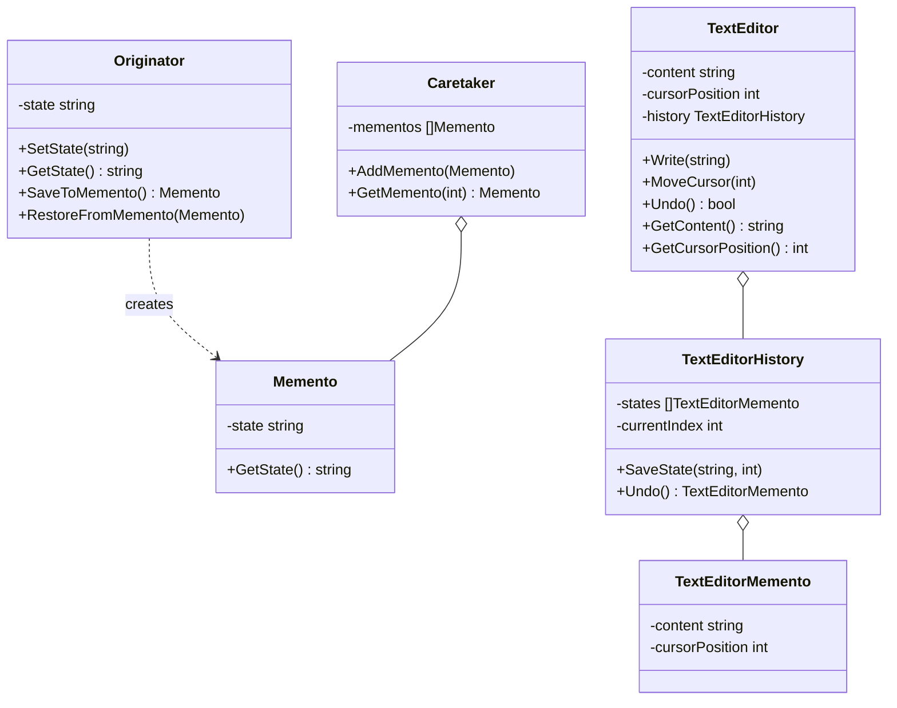

# 备忘录模式（Memento）
备忘录模式在不破坏封装性的前提下，捕获一个对象的内部状态，并在该对象之外保存这个状态，以便以后当需要时能将该对象恢复到原先保存的状态。

## 主要解决的问题
- 需要保存和恢复数据的场景
- 需要提供回滚操作的场景
- 需要监控副本的场景
- 需要保存历史快照的场景

## 应用实例
1. IDE的撤销/重做功能
2. 数据库的事务管理
3. 浏览器的前进/后退功能
4. 游戏存档/读档系统

## 使用场景
1. 文本编辑器
   - 撤销/重做操作
   - 自动保存
   - 版本控制
2. 游戏系统
   - 存档点管理
   - 状态恢复
   - 关卡重置
3. 数据库操作
   - 事务回滚
   - 快照恢复
   - 版本管理
4. 图形编辑器
   - 操作历史
   - 状态恢复
   - 多级撤销

## 优缺点
### 优点
1. 提供了可靠的恢复机制
   - 可以方便地恢复到历史状态
   - 避免了对象状态的暴露
2. 封装性好
   - 保存的细节对客户透明
   - 状态的保存和恢复独立于原始类
3. 提供了可靠的快照机制
   - 可以实现多个保存点
   - 便于实现撤销/重做功能

### 缺点
1. 资源消耗
   - 可能需要存储大量的状态
   - 保存的状态越多，消耗的内存越大
2. 性能影响
   - 频繁的状态保存会影响性能
   - 状态的序列化和反序列化可能耗时
3. 维护成本
   - 需要维护状态的生命周期
   - 需要考虑状态清理的策略

## 代码实现

```golang
package designpattern

// Memento 备忘录
type Memento struct {
    state string
}

func NewMemento(state string) *Memento {
    return &Memento{state: state}
}

func (m *Memento) GetState() string {
    return m.state
}

// Originator 发起人
type Originator struct {
    state string
}

func (o *Originator) SetState(state string) {
    o.state = state
}

func (o *Originator) GetState() string {
    return o.state
}

func (o *Originator) SaveToMemento() *Memento {
    return NewMemento(o.state)
}

func (o *Originator) RestoreFromMemento(memento *Memento) {
    o.state = memento.GetState()
}

// Caretaker 管理者
type Caretaker struct {
    mementos []*Memento
}

func NewCaretaker() *Caretaker {
    return &Caretaker{
        mementos: make([]*Memento, 0),
    }
}

func (c *Caretaker) AddMemento(memento *Memento) {
    c.mementos = append(c.mementos, memento)
}

func (c *Caretaker) GetMemento(index int) *Memento {
    if index >= 0 && index < len(c.mementos) {
        return c.mementos[index]
    }
    return nil
}

// 实际应用示例：文本编辑器
type TextEditorMemento struct {
    content string
    cursorPosition int
}

func NewTextEditorMemento(content string, cursorPosition int) *TextEditorMemento {
    return &TextEditorMemento{
        content: content,
        cursorPosition: cursorPosition,
    }
}

type TextEditor struct {
    content string
    cursorPosition int
    history *TextEditorHistory
}

func NewTextEditor() *TextEditor {
    return &TextEditor{
        history: NewTextEditorHistory(),
    }
}

func (e *TextEditor) Write(text string) {
    e.history.SaveState(e.content, e.cursorPosition)
    if e.cursorPosition > len(e.content) {
        e.content += text
    } else {
        e.content = e.content[:e.cursorPosition] + text + e.content[e.cursorPosition:]
    }
    e.cursorPosition += len(text)
}

func (e *TextEditor) MoveCursor(position int) {
    if position >= 0 && position <= len(e.content) {
        e.cursorPosition = position
    }
}

func (e *TextEditor) Undo() bool {
    if state := e.history.Undo(); state != nil {
        e.content = state.content
        e.cursorPosition = state.cursorPosition
        return true
    }
    return false
}

func (e *TextEditor) GetContent() string {
    return e.content
}

func (e *TextEditor) GetCursorPosition() int {
    return e.cursorPosition
}

type TextEditorHistory struct {
    states []*TextEditorMemento
    currentIndex int
}

func NewTextEditorHistory() *TextEditorHistory {
    return &TextEditorHistory{
        states: make([]*TextEditorMemento, 0),
        currentIndex: -1,
    }
}

func (h *TextEditorHistory) SaveState(content string, cursorPosition int) {
    // 移除当前状态之后的所有状态
    if h.currentIndex < len(h.states)-1 {
        h.states = h.states[:h.currentIndex+1]
    }
    h.states = append(h.states, NewTextEditorMemento(content, cursorPosition))
    h.currentIndex++
}

func (h *TextEditorHistory) Undo() *TextEditorMemento {
    if h.currentIndex > 0 {
        h.currentIndex--
        return h.states[h.currentIndex]
    }
    return nil
}
```

## 使用示例

```golang
func main() {
    // 基本示例
    originator := &Originator{}
    caretaker := NewCaretaker()
    
    originator.SetState("State 1")
    caretaker.AddMemento(originator.SaveToMemento())
    
    originator.SetState("State 2")
    caretaker.AddMemento(originator.SaveToMemento())
    
    originator.SetState("State 3")
    fmt.Println("Current State:", originator.GetState())
    
    originator.RestoreFromMemento(caretaker.GetMemento(1))
    fmt.Println("Restored to State:", originator.GetState())
    
    // 文本编辑器示例
    editor := NewTextEditor()
    
    editor.Write("Hello")
    fmt.Printf("Content: %s, Cursor: %d\n", editor.GetContent(), editor.GetCursorPosition())
    
    editor.Write(" World")
    fmt.Printf("Content: %s, Cursor: %d\n", editor.GetContent(), editor.GetCursorPosition())
    
    editor.Undo()
    fmt.Printf("After undo - Content: %s, Cursor: %d\n", editor.GetContent(), editor.GetCursorPosition())
}
```

## 类图


## 说明
1. 备忘录模式的主要角色：
   - Originator（发起人）：记录当前时刻的内部状态，定义创建和恢复备忘录的接口
   - Memento（备忘录）：负责存储Originator对象的内部状态
   - Caretaker（管理者）：负责保存备忘录，不能对备忘录的内容进行操作或检查
2. 实现要点：
   - 状态的保存和恢复机制
   - 备忘录的存储策略
   - 状态历史的管理方式
3. 设计考虑：
   - 是否需要深拷贝
   - 是否需要压缩存储
   - 是否需要多层撤销
4. 相关模式：
   - 原型模式：用于状态的克隆
   - 命令模式：实现可撤销操作
   - 迭代器模式：遍历历史状态