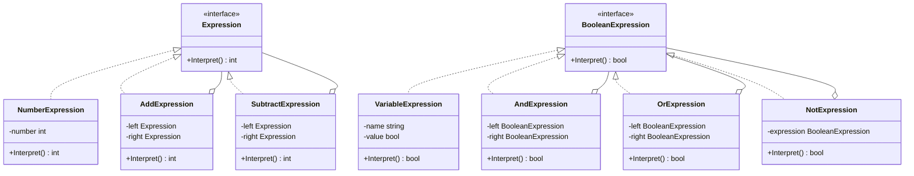

# 解释器模式（Interpreter）
解释器模式提供了评估语言的语法或表达式的方式。这种模式实现了一个表达式接口，该接口解释一个特定的上下文。这种模式被用在 SQL 解析、符号处理引擎等。

## 主要解决的问题
- 如何解释和执行特定语法规则的问题
- 如何构建一个简单的语言解释器
- 如何在不修改语法的情况下扩展解释器功能

## 应用实例
1. SQL解析器的实现
2. 编程语言的编译器
3. 正则表达式引擎
4. Shell脚本解释器

## 使用场景
1. 特定领域语言(DSL)
   - 配置文件解析
   - 模板引擎
   - 规则引擎
2. 数学表达式
   - 计算器
   - 公式解析器
   - 单位转换器
3. 编译系统
   - 词法分析
   - 语法分析
   - 中间代码生成
4. 自然语言处理
   - 语法树构建
   - 语义分析
   - 机器翻译

## 优缺点
### 优点
1. 扩展性好
   - 易于改变和扩展文法
   - 每个规则类只需关注自身的解释
2. 容易实现文法
   - 将复杂问题分解为简单的小问题
   - 类的结构与文法规则一一对应
3. 良好的封装性
   - 语法规则封装在类中
   - 增加新的语法规则只需增加新类

### 缺点
1. 类数量膨胀
   - 每个语法规则都需要一个类
   - 语法规则越多，类的数量越多
2. 性能问题
   - 递归调用会影响性能
   - 解释器模式使用了大量的循环和递归
3. 调试困难
   - 规则交错复杂
   - 调试时难以定位问题


## 代码实现

```golang
package designpattern

// Expression 定义解释器接口
type Expression interface {
    Interpret() int
}

// NumberExpression 数字表达式
type NumberExpression struct {
    number int
}

func NewNumberExpression(number int) *NumberExpression {
    return &NumberExpression{number: number}
}

func (n *NumberExpression) Interpret() int {
    return n.number
}

// AddExpression 加法表达式
type AddExpression struct {
    left  Expression
    right Expression
}

func NewAddExpression(left, right Expression) *AddExpression {
    return &AddExpression{
        left:  left,
        right: right,
    }
}

func (a *AddExpression) Interpret() int {
    return a.left.Interpret() + a.right.Interpret()
}

// SubtractExpression 减法表达式
type SubtractExpression struct {
    left  Expression
    right Expression
}

func NewSubtractExpression(left, right Expression) *SubtractExpression {
    return &SubtractExpression{
        left:  left,
        right: right,
    }
}

func (s *SubtractExpression) Interpret() int {
    return s.left.Interpret() - s.right.Interpret()
}

// 实际应用示例：简单的布尔表达式解释器
type BooleanExpression interface {
    Interpret() bool
}

// VariableExpression 变量表达式
type VariableExpression struct {
    name  string
    value bool
}

func NewVariableExpression(name string, value bool) *VariableExpression {
    return &VariableExpression{
        name:  name,
        value: value,
    }
}

func (v *VariableExpression) Interpret() bool {
    return v.value
}

// AndExpression AND表达式
type AndExpression struct {
    left  BooleanExpression
    right BooleanExpression
}

func NewAndExpression(left, right BooleanExpression) *AndExpression {
    return &AndExpression{
        left:  left,
        right: right,
    }
}

func (a *AndExpression) Interpret() bool {
    return a.left.Interpret() && a.right.Interpret()
}

// OrExpression OR表达式
type OrExpression struct {
    left  BooleanExpression
    right BooleanExpression
}

func NewOrExpression(left, right BooleanExpression) *OrExpression {
    return &OrExpression{
        left:  left,
        right: right,
    }
}

func (o *OrExpression) Interpret() bool {
    return o.left.Interpret() || o.right.Interpret()
}

// NotExpression NOT表达式
type NotExpression struct {
    expression BooleanExpression
}

func NewNotExpression(expression BooleanExpression) *NotExpression {
    return &NotExpression{expression: expression}
}

func (n *NotExpression) Interpret() bool {
    return !n.expression.Interpret()
}
```

## 使用示例

```golang
func main() {
    // 数学表达式示例: (5 + 3) - 2
    five := NewNumberExpression(5)
    three := NewNumberExpression(3)
    add := NewAddExpression(five, three)
    two := NewNumberExpression(2)
    subtract := NewSubtractExpression(add, two)
    
    result := subtract.Interpret()
    fmt.Printf("(5 + 3) - 2 = %d\n", result)
    
    // 布尔表达式示例: (true AND false) OR (true AND true)
    trueExp := NewVariableExpression("true", true)
    falseExp := NewVariableExpression("false", false)
    
    and1 := NewAndExpression(trueExp, falseExp)
    and2 := NewAndExpression(trueExp, trueExp)
    or := NewOrExpression(and1, and2)
    
    result := or.Interpret()
    fmt.Printf("(true AND false) OR (true AND true) = %v\n", result)
    
    // NOT表达式示例
    not := NewNotExpression(trueExp)
    fmt.Printf("NOT true = %v\n", not.Interpret())
}
```

## 类图


## 说明
1. 解释器模式的主要角色：
   - AbstractExpression（抽象表达式）：声明一个抽象的解释操作
   - TerminalExpression（终结符表达式）：实现与文法中的终结符相关的解释操作
   - NonterminalExpression（非终结符表达式）：为文法中的非终结符实现解释操作
   - Context（上下文）：包含解释器之外的一些全局信息
2. 实现要点：
   - 将每个语法规则对应一个类
   - 使用组合模式构建抽象语法树
   - 考虑使用享元模式共享终结符
3. 设计考虑：
   - 是否需要完整的解释器，还是简单的解析器就够了
   - 是否需要支持语法扩展
   - 是否需要考虑性能优化
4. 相关模式：
   - 组合模式：用于构建抽象语法树
   - 享元模式：用于共享终结符
   - 访问者模式：用于操作抽象语法树
