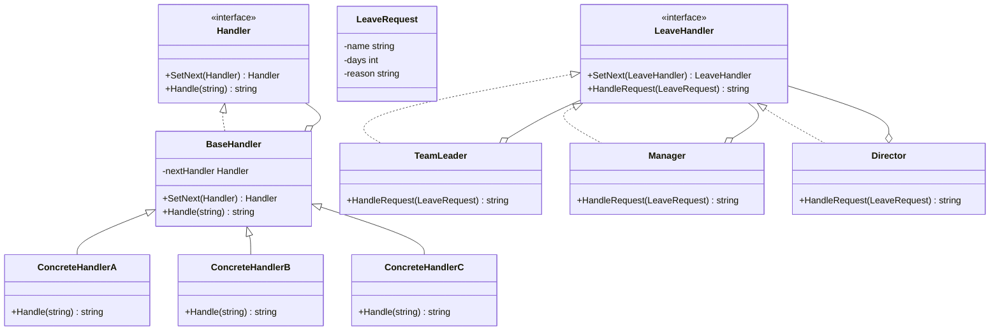

# 责任链模式（Chain of Responsibility）
责任链模式为请求创建了一个接收者对象的链。这种模式给予请求的类型，对请求的发送者和接收者进行解耦。这种类型的设计模式属于行为型模式。

## 主要解决的问题
- 职责链上的处理者负责处理请求，客户只需要将请求发送到职责链上即可，无须关心请求的处理细节和请求的传递
- 当需要动态指定一组对象处理请求时，可以通过职责链模式来实现
- 可以动态地改变链内的成员或调动它们的次序，便于添加或删除处理者

## 应用实例
1. Java中的异常处理机制
2. JavaScript中的事件冒泡
3. Apache Tomcat中的Filter过滤器
4. Spring Security的过滤器链
5. 日志记录器
6. 请求审批流程
7. 事件处理系统
8. 异常处理机制

## 使用场景
1. 日志记录器
   - 不同级别的日志由不同的对象来处理
   - DEBUG -> INFO -> WARNING -> ERROR
2. 请求审批流程
   - 采购审批流程
   - 报销审批流程
   - 请假审批流程
3. 事件处理系统
   - GUI系统中的事件传播
   - Web服务器的过滤器链
4. 异常处理机制
   - 异常的逐级传递和处理
   - 中间件的异常处理链

## 优缺点
### 优点
1. 降低耦合度
   - 一个对象无需知道是其他哪一个对象处理其请求
   - 对象仅需知道该请求会被处理即可
2. 增强给对象指派职责的灵活性
   - 可以在运行时动态改变链内的成员
   - 可以改变链内成员的次序
3. 符合开闭原则
   - 新增处理者无需修改原有代码
   - 可以在不影响其他对象的情况下向链中增加新的处理者

### 缺点
1. 性能问题
   - 链过长会影响性能
   - 调试不方便
2. 请求可能得不到处理
   - 可能没有任何一个处理者处理请求
   - 需要在设计时考虑全面
3. 循环引用问题
   - 如果链中出现循环引用，可能导致死循环
   - 需要在设计时避免出现循环调用

## 代码实现

```golang
package designpattern

// Handler 定义处理者接口
type Handler interface {
    SetNext(handler Handler) Handler
    Handle(request string) string
}

// BaseHandler 提供基础实现
type BaseHandler struct {
    nextHandler Handler
}

func (h *BaseHandler) SetNext(handler Handler) Handler {
    h.nextHandler = handler
    return handler
}

func (h *BaseHandler) Handle(request string) string {
    if h.nextHandler != nil {
        return h.nextHandler.Handle(request)
    }
    return ""
}

// ConcreteHandlerA 具体处理者A
type ConcreteHandlerA struct {
    BaseHandler
}

func (h *ConcreteHandlerA) Handle(request string) string {
    if request == "A" {
        return "Handler A handled " + request
    }
    return h.BaseHandler.Handle(request)
}

// ConcreteHandlerB 具体处理者B
type ConcreteHandlerB struct {
    BaseHandler
}

func (h *ConcreteHandlerB) Handle(request string) string {
    if request == "B" {
        return "Handler B handled " + request
    }
    return h.BaseHandler.Handle(request)
}

// ConcreteHandlerC 具体处理者C
type ConcreteHandlerC struct {
    BaseHandler
}

func (h *ConcreteHandlerC) Handle(request string) string {
    if request == "C" {
        return "Handler C handled " + request
    }
    return h.BaseHandler.Handle(request)
}

// 实际应用示例：请假审批系统
type LeaveRequest struct {
    name     string
    days     int
    reason   string
}

func NewLeaveRequest(name string, days int, reason string) *LeaveRequest {
    return &LeaveRequest{
        name:   name,
        days:   days,
        reason: reason,
    }
}

type LeaveHandler interface {
    SetNext(handler LeaveHandler) LeaveHandler
    HandleRequest(request *LeaveRequest) string
}

type BaseLeaveHandler struct {
    nextHandler LeaveHandler
}

func (h *BaseLeaveHandler) SetNext(handler LeaveHandler) LeaveHandler {
    h.nextHandler = handler
    return handler
}

// TeamLeader 团队领导（可以批准3天以内的假期）
type TeamLeader struct {
    BaseLeaveHandler
}

func (h *TeamLeader) HandleRequest(request *LeaveRequest) string {
    if request.days <= 3 {
        return fmt.Sprintf("TeamLeader approved %s's leave request for %d days", 
            request.name, request.days)
    }
    if h.nextHandler != nil {
        return h.nextHandler.HandleRequest(request)
    }
    return "Leave request denied"
}

// Manager 经理（可以批准7天以内的假期）
type Manager struct {
    BaseLeaveHandler
}

func (h *Manager) HandleRequest(request *LeaveRequest) string {
    if request.days <= 7 {
        return fmt.Sprintf("Manager approved %s's leave request for %d days", 
            request.name, request.days)
    }
    if h.nextHandler != nil {
        return h.nextHandler.HandleRequest(request)
    }
    return "Leave request denied"
}

// Director 总监（可以批准14天以内的假期）
type Director struct {
    BaseLeaveHandler
}

func (h *Director) HandleRequest(request *LeaveRequest) string {
    if request.days <= 14 {
        return fmt.Sprintf("Director approved %s's leave request for %d days", 
            request.name, request.days)
    }
    if h.nextHandler != nil {
        return h.nextHandler.HandleRequest(request)
    }
    return "Leave request denied"
}
```

## 使用示例

```golang
func main() {
    // 基本示例
    handlerA := &ConcreteHandlerA{}
    handlerB := &ConcreteHandlerB{}
    handlerC := &ConcreteHandlerC{}
    
    handlerA.SetNext(handlerB).SetNext(handlerC)
    
    fmt.Println(handlerA.Handle("A"))
    fmt.Println(handlerA.Handle("B"))
    fmt.Println(handlerA.Handle("C"))
    fmt.Println(handlerA.Handle("D"))
    
    // 请假审批示例
    teamLeader := &TeamLeader{}
    manager := &Manager{}
    director := &Director{}
    
    teamLeader.SetNext(manager)
    manager.SetNext(director)
    
    request1 := NewLeaveRequest("John", 2, "Personal matters")
    request2 := NewLeaveRequest("Alice", 5, "Family vacation")
    request3 := NewLeaveRequest("Bob", 10, "Medical treatment")
    request4 := NewLeaveRequest("Emma", 15, "Long vacation")
    
    fmt.Println(teamLeader.HandleRequest(request1))
    fmt.Println(teamLeader.HandleRequest(request2))
    fmt.Println(teamLeader.HandleRequest(request3))
    fmt.Println(teamLeader.HandleRequest(request4))
}
```

## 类图


## 说明
1. 责任链模式的主要角色：
   - Handler（处理者）：定义一个处理请求的接口
   - ConcreteHandler（具体处理者）：处理它所负责的请求，可访问它的后继者
   - Client（客户端）：向链上的具体处理者对象提交请求
2. 实现要点：
   - 定义统一的处理接口
   - 实现链的组装机制
   - 考虑请求的传递方式
3. 设计考虑：
   - 是否需要双向链
   - 是否需要分支处理
   - 是否需要并行处理
4. 相关模式：
   - 命令模式：请求封装
   - 组合模式：链式结构
   - 装饰器模式：动态添加职责
