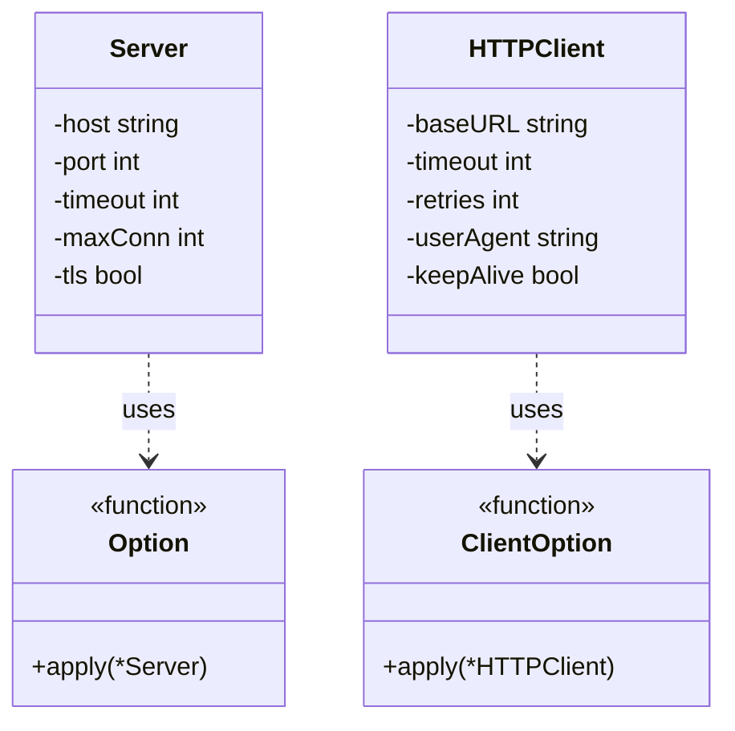

# 函数选项模式（Function Option）
函数选项模式是一种用于配置复杂对象的设计模式，它通过一系列选项函数来设置对象的可选参数。这种模式在Go语言中特别常见，用于解决具有多个可选配置参数的问题。

## 主要解决的问题
- 如何处理大量可选参数
- 如何保持函数签名的稳定性
- 如何实现参数的默认值
- 如何确保参数设置的类型安全

## 应用实例
1. gRPC的服务器配置
2. HTTP客户端选项
3. 数据库连接配置
4. 日志记录器初始化

## 使用场景
1. 对象配置
   - 服务器配置
   - 客户端配置
   - 中间件配置
2. 参数设置
   - 超时设置
   - 重试策略
   - 缓存选项
3. 功能开关
   - 特性开关
   - 调试选项
   - 性能选项
4. 构建器模式
   - 对象构建
   - 链式调用
   - 流式处理

## 优缺点
### 优点
1. 灵活性高
   - 参数可选
   - 默认值支持
2. 可维护性好
   - 参数独立管理
   - 易于扩展
3. 类型安全
   - 编译时检查
   - 参数验证

### 缺点
1. 代码量增加
   - 需要定义选项函数
   - 需要实现应用逻辑
2. 学习成本
   - 模式理解
   - 使用方式
3. 性能开销
   - 函数调用开销
   - 内存分配

## 代码实现

```golang
package designpattern

// Server 定义服务器结构
type Server struct {
    host    string
    port    int
    timeout int
    maxConn int
    tls     bool
}

// Option 定义配置函数类型
type Option func(*Server)

// WithHost 设置主机地址
func WithHost(host string) Option {
    return func(s *Server) {
        s.host = host
    }
}

// WithPort 设置端口
func WithPort(port int) Option {
    return func(s *Server) {
        s.port = port
    }
}

// WithTimeout 设置超时时间
func WithTimeout(timeout int) Option {
    return func(s *Server) {
        s.timeout = timeout
    }
}

// WithMaxConn 设置最大连接数
func WithMaxConn(maxConn int) Option {
    return func(s *Server) {
        s.maxConn = maxConn
    }
}

// WithTLS 设置是否启用TLS
func WithTLS(tls bool) Option {
    return func(s *Server) {
        s.tls = tls
    }
}

// NewServer 创建服务器实例
func NewServer(options ...Option) *Server {
    // 默认配置
    server := &Server{
        host:    "localhost",
        port:    8080,
        timeout: 30,
        maxConn: 100,
        tls:     false,
    }
    
    // 应用自定义配置
    for _, option := range options {
        option(server)
    }
    
    return server
}

// 实际应用示例：HTTP客户端
type HTTPClient struct {
    baseURL    string
    timeout    int
    retries    int
    userAgent  string
    keepAlive  bool
}

type ClientOption func(*HTTPClient)

func WithBaseURL(url string) ClientOption {
    return func(c *HTTPClient) {
        c.baseURL = url
    }
}

func WithClientTimeout(timeout int) ClientOption {
    return func(c *HTTPClient) {
        c.timeout = timeout
    }
}

func WithRetries(retries int) ClientOption {
    return func(c *HTTPClient) {
        c.retries = retries
    }
}

func WithUserAgent(userAgent string) ClientOption {
    return func(c *HTTPClient) {
        c.userAgent = userAgent
    }
}

func WithKeepAlive(keepAlive bool) ClientOption {
    return func(c *HTTPClient) {
        c.keepAlive = keepAlive
    }
}

func NewHTTPClient(options ...ClientOption) *HTTPClient {
    // 默认配置
    client := &HTTPClient{
        baseURL:    "http://localhost",
        timeout:    30,
        retries:    3,
        userAgent:  "default-client",
        keepAlive:  true,
    }
    
    // 应用自定义配置
    for _, option := range options {
        option(client)
    }
    
    return client
}
```

## 使用示例

```golang
func main() {
    // 服务器配置示例
    server := NewServer(
        WithHost("example.com"),
        WithPort(443),
        WithTimeout(60),
        WithMaxConn(1000),
        WithTLS(true),
    )
    
    // HTTP客户端配置示例
    client := NewHTTPClient(
        WithBaseURL("https://api.example.com"),
        WithClientTimeout(60),
        WithRetries(5),
        WithUserAgent("custom-client"),
        WithKeepAlive(true),
    )
}
```

## 类图


## 说明
1. 函数选项模式的主要角色：
   - Option（选项接口）：定义选项函数类型
   - OptionFunc（选项函数）：实现具体的配置逻辑
   - Config（配置结构）：存储配置信息
   - Builder（构建器）：应用配置选项
2. 实现要点：
   - 选项函数的设计
   - 默认值的处理
   - 配置的验证
3. 设计考虑：
   - 是否需要配置验证
   - 是否需要配置合并
   - 是否需要配置重置
4. 相关模式：
   - 建造者模式：构建复杂对象
   - 装饰器模式：动态添加功能
   - 策略模式：不同的配置策略
