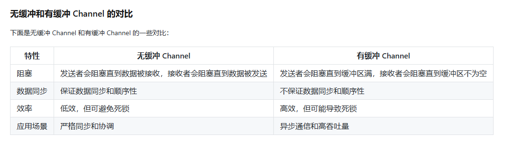
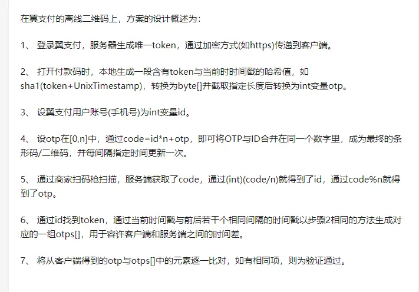

### 讲讲go的反射
go的反射，我只在书上看到过，但是项目中，我并没有用过反射。我只是知道反射是能反射出输入数据的数据类型。
下面是整理
反射就是能检查程序在运行时的状态
reflect.ValueOf(h)，得到实际的值，并且可以改变其字段值；
reflect.TypeOf(h)，得到类型的元数据,通过t我们能获取类型定义里面的所有元素；
如果需修改value，该struct类型的字段必须是大写，小写相当于private，是不能通过反射修改的，会报异常.

### 谈谈对go反射的使用
使用gorm的使用利用tag和reflect进行数据映射。将传入参数的struct进行反射，然后根据tag进行映射到表单对象上。（进行更新和新增操作）

### go里面的同步和异步中，go进程是如何完成等待的和执行的。
go进程的等待是阻塞的，也就是说当我go一个进程之后，用sync.WaitGroup进行进程的管理，进程增加就是Add()，进程在执行就用Wait()对其进行阻塞等待。然后再用Done()完成。这样能对进程之间进行安全的管理。

### 判断运算结果是否产生溢出
#### 无符号数判断
判断方法：最高位向前是否有进位或错位！如果有，则溢出。
#### 有符号数判断
判断方法：最高位的进（借）位状态和次高位的进（借）位状态的异或结果。
结果为 1，则溢出；结果为 0，则不溢出。

### 值传递和引用传递
值传递：值传递是传值，函数调用时，将参数的值复制一份给函数的形参。
引用传递：引用传递是传地址，函数调用时，将参数的地址复制一份给函数的形参。

### make 和 new 有什么区别？
make 一般用来创建引用类型 slice、map 以及 channel 等等，并且是非零值的。而 new 用于类型的内存分配，并且内存置为零。make 返回的是引用类型本身；而 new 返回的是指向类型的指针。

### slice 和 array 有区别吗？
slice， 是切片，是引用类型，长度可变。
array，是数组，是值类型，长度不可变。

## 1. 并发编程

### 什么是 Channel？
在 Go 语言中，Channel 是一种特殊的数据结构，它可以在 Goroutine 之间进行通信和同步。Channel 可以看作是一个队列，其中 Goroutine 可以向 Channel 发送消息或从 Channel 接收消息。通过 Channel，不同的 Goroutine 可以安全地传递数据，并保证数据的**同步和顺序性**。

### Go 语言当中 Channel（通道）有什么特点，需要注意什么？
如果给一个 nil 的 channel 发送数据，会造成永远阻塞。
如果从一个 nil 的 channel 中接收数据，也会造成永久阻塞。
给一个已经关闭的 channel 发送数据， 会引起 panic
从一个已经关闭的 channel 接收数据， 如果缓冲区中为空，则返回一个零
值。

### Go 语言当中 Channel 缓冲有什么特点？
无缓冲的 channel 是同步的，而有缓冲的 channel 是非同步的。

### 支付过程为什么不是同步的？
支付过程是异步的，因为支付过程需要调用第三方接口，第三方接口可能返回失败，也可能返回成功，但是这个过程是异步的。

### 离线支付原理
离线支付原理和Google Authoritazation生成动态口令原理相似
- Google Authoritazation 生成动态口令原理：客户端和服务端都会保存一个密钥，当使用动态口令的时候，客户端会通过保存的密钥加上一定的时间差值进行加密算法生成动态口令码，验证时，服务器会根据这个客户的密钥去进行算法生成动态口令，然后和客户端传过来的动态口令进行比较。 
- 支付时的密钥采用动态密钥的方式

## 2. 网络基础知识

### 2.1. 输入URL到显示页面的全过程
首先，我们需要进行 DNS 解析域名得到对应的 IP，然后通过 ARP 解析 IP 得到对应的 MAC（Media Access Control Address）地址。
然后建立通信过程，建立 TCP 连接，即三次握手过程。然后，利用 TCP 通道进行数据传输。最后，断开 TCP 连接，即四次握手过程。当网络进程接收到的响应报文状态码，进行相应的操作。然后将数据内容进行渲染解析到页面展示给用户看。

[相关流程解析](https://segmentfault.com/a/1190000022262262)
1. DNS 解析
DNS 解析域名的过程分为以下几个步骤：
- 询问浏览器 DNS 缓存
- 询问本地操作系统 DNS 缓存（即查找本地 host 文件）
- 询问 ISP（Internet Service Provider）互联网服务提供商（例如电信、移动）的 DNS 服务器
- 询问根服务器，这个过程可以进行递归和迭代两种查找的方式，两者都是先询问顶级域名服务器查找

### 2.2.谈谈你对SSL证书的理解
服务器认证阶段：
1）客户端向服务器发送一个开始信息“Hello”以便开始一个新的会话连接；
2）服务器根据客户的信息确定是否需要生成新的主密钥，如需要则服务器在响应客户的“Hello”信息时将包含生成主密钥所需的信息；
3）客户根据收到的服务器响应信息，产生一个主密钥，并用服务器的公开密钥加密后传给服务器；
4）服务器回复该主密钥，并返回给客户一个用主密钥认证的信息，以此让客户认证服务器。

用户认证阶段：
1）在此之前，服务器已经通过了客户认证，这一阶段主要完成对客户的认证。
2）经认证的服务器发送一个提问给客户，客户则返回（数字）签名后的提问和其公开密钥，从而向服务器提供认证。
SSL协议提供的安全通道有以下三个特性：
机密性：SSL协议使用密钥加密通信数据。
可靠性：服务器和客户都会被认证，客户的认证是可选的。
完整性：SSL协议会对传送的数据进行完整性检查。
