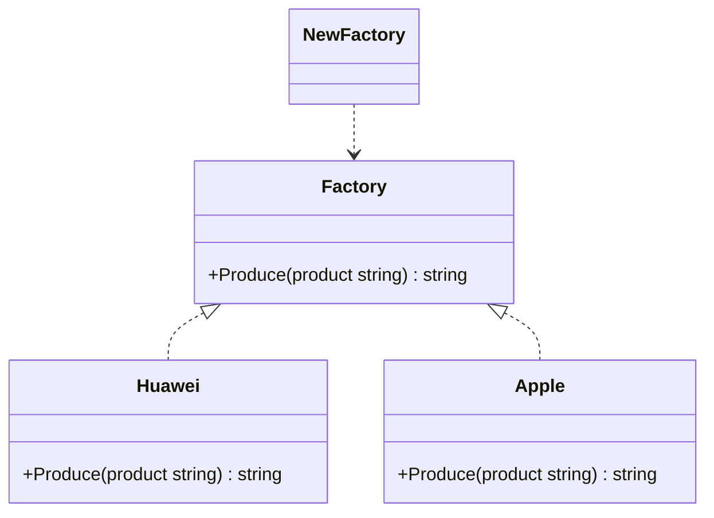

# 简单工厂模式
go 语言没有构造函数一说，所以一般会定义 NewXXX 函数来初始化相关类。 NewXXX 函数返回接口时就是简单工厂模式，也就是说 Golang 的一般推荐做法就是简单工厂。

在这个 simplefactory 包中只有API 接口和 NewAPI 函数为包外可见，封装了实现细节。

```golang
package simplefactory

type Factory interface{
    Produce(product string) string
}

type Huawei struct{}
func (*Huawei) Produce(product string) string{
    return fmt.Sprint("hi %s", product)
}

type Apple struct{}
func (*Apple) Produce(product string) string{
    return fmt.Sprint("hi %s", product)
}

func NewFactory(type int) Factory{
    if type == 1{
        return &Huawei{}
    }else if type == 2{
        return &Apple{}
    }
    return nil
}

```

### 类图
