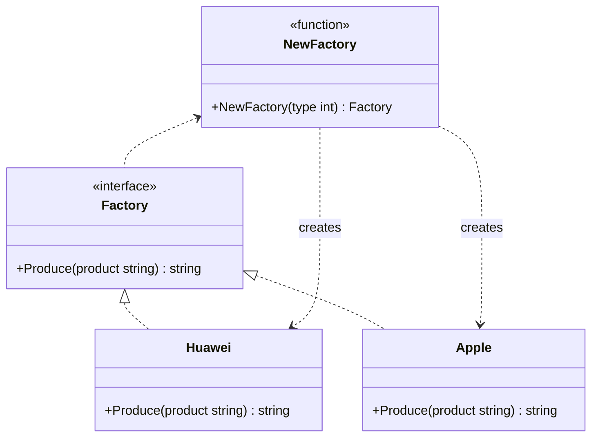

# 简单工厂模式
go 语言没有构造函数一说，所以一般会定义 NewXXX 函数来初始化相关类。 NewXXX 函数返回接口时就是简单工厂模式，也就是说 Golang 的一般推荐做法就是简单工厂。

在这个 simplefactory 包中只有API 接口和 NewAPI 函数为包外可见，封装了实现细节。

## 代码实现

```golang
package designpattern

import "fmt"

type Factory interface {
	Produce(product string) string
}

type Huawei struct{}

func (*Huawei) Produce(product string) string {
	return fmt.Sprintf("hi %s", product)
}

type Apple struct{}

func (*Apple) Produce(product string) string {
	return fmt.Sprintf("hi %s", product)
}

func NewFactory(factoryType int) Factory {
	if factoryType == 1 {
		return &Huawei{}
	} else if factoryType == 2 {
		return &Apple{}
	}
	return nil
}
```

## 使用示例

```golang
func main() {
    // 创建华为工厂
    huaweiFactory := NewFactory(1)
    fmt.Println(huaweiFactory.Produce("phone"))  // 输出: hi phone

    // 创建苹果工厂
    appleFactory := NewFactory(2)
    fmt.Println(appleFactory.Produce("iPhone"))  // 输出: hi iPhone
}
```

## 类图


## 说明
1. Factory 接口定义了产品的基本行为
2. Huawei 和 Apple 是具体的产品实现
3. NewFactory 是简单工厂函数，根据传入的类型创建具体的产品
4. 使用简单工厂模式，客户端无需知道具体的产品实现细节