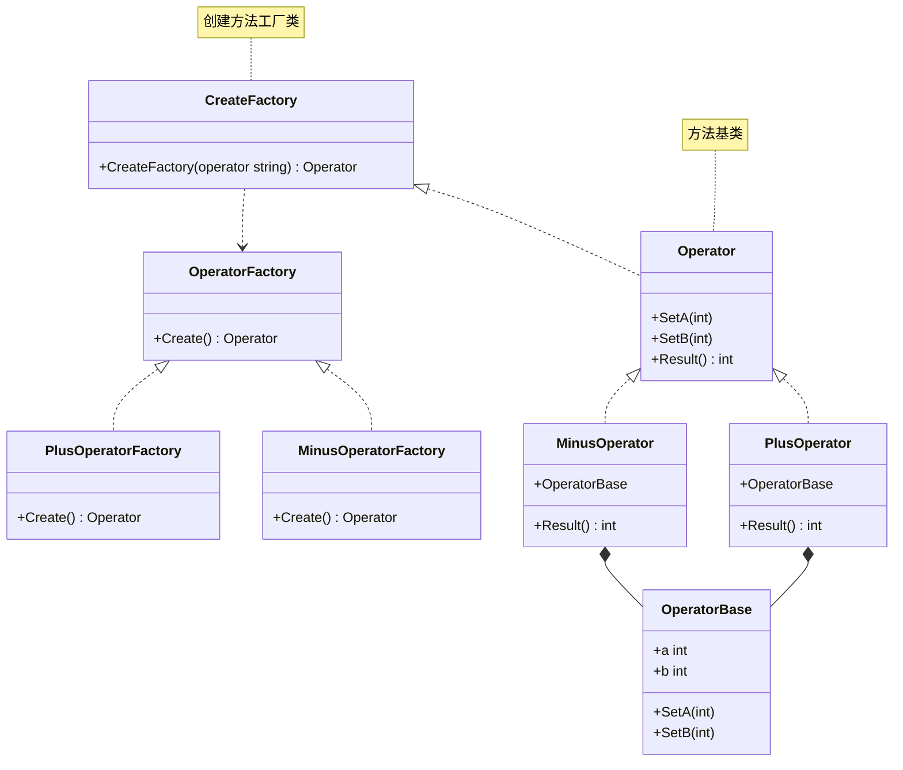

# 工厂方法模式
工厂方法模式使用子类的方式延迟生成对象到子类中实现
Go 中不存在继承 所以使用匿名组合来实现

当对象的创建逻辑比较复杂，不只是简单的 new 一下就可以，而是要组合其他类对象，做各种初始化操作的时候，我们推荐使用工厂方法模式，将复杂的创建逻辑拆分到多个工厂类中，让每个工厂类都不至于过于复杂


> 创建的是工厂方法, 实际上就是对方法的封装，比简单工厂多了一层方法
> 简单工厂是：工厂
> 工厂方法是：方法 ---> 工厂

```golang
package designpattern

type OperatorType string

const (
	OperatorPlus  OperatorType = "plus"
	OperatorMinus OperatorType = "minus"
)

// 方法
type Operator interface {
	SetA(int)
	SetB(int)
	Result() int
}

// 方法基类
type OperatorBase struct {
	a, b int
}

func (o *OperatorBase) SetA(a int) {
	o.a = a
}

func (o *OperatorBase) SetB(b int) {
	o.b = b
}

// 加法
type PlusOperator struct {
	*OperatorBase
}

func (o *PlusOperator) Result() int {
	return o.a + o.b
}

// 减法
type MinusOperator struct {
	*OperatorBase
}

func (o *MinusOperator) Result() int {
	return o.a - o.b
}

// 工厂方法
type OperatorFactory interface {
	Create() Operator
}

// 加法工厂类
type PlusOperatorFactory struct{ OperatorFactory }

func (f *PlusOperatorFactory) Create() Operator {
	return &PlusOperator{
		OperatorBase: &OperatorBase{},
	}
}

// 减法工厂类
type MinusOperatorFactory struct{ OperatorFactory }

func (f *MinusOperatorFactory) Create() Operator {
	return &MinusOperator{
		OperatorBase: &OperatorBase{},
	}
}

// 创建方法工厂类
func CreateFactory(operator OperatorType) Operator {
	switch operator {
	case OperatorPlus:
		factory := &PlusOperatorFactory{}
		return factory.Create()
	case OperatorMinus:
		factory := &MinusOperatorFactory{}
		return factory.Create()
	}
	return nil
}
```


### 类图
