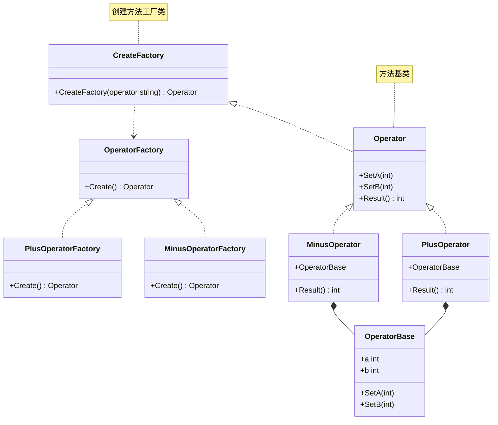

# 工厂方法模式（Factory Method）
工厂方法模式定义一个用于创建对象的接口，让子类决定实例化哪一个类。工厂方法使一个类的实例化延迟到其子类。

## 主要解决的问题
- 如何封装对象创建的变化
- 如何实现基于接口而非实现的编程
- 如何让子类决定创建什么对象
- 如何实现创建逻辑的扩展

## 应用实例
1. Collection.iterator()
2. Spring的FactoryBean
3. 日志记录器工厂
4. 数据库连接工厂

## 使用场景
1. 对象创建
   - 产品族生产
   - 组件实例化
   - 服务提供者
2. 框架扩展
   - 插件系统
   - 驱动加载
   - 协议处理
3. 业务处理
   - 文档处理
   - 数据转换
   - 消息处理
4. 系统集成
   - 第三方接入
   - 平台适配
   - 服务整合

## 优缺点
### 优点
1. 扩展性好
   - 新增工厂容易
   - 符合开闭原则
2. 解耦合
   - 创建和使用分离
   - 面向接口编程
3. 封装性好
   - 具体类型隐藏
   - 实现细节封装

### 缺点
1. 类数量增加
   - 每个产品都需要工厂
   - 系统复杂度增加
2. 抽象层次增加
   - 理解难度增加
   - 调试难度增加
3. 客户端耦合
   - 需要知道具体工厂
   - 配置复杂度增加

[原有的代码实现、使用示例和类图部分保持不变...]

## 说明
1. 工厂方法模式的主要角色：
   - Creator（抽象工厂）：声明工厂方法
   - ConcreteCreator（具体工厂）：实现工厂方法
   - Product（抽象产品）：定义产品接口
   - ConcreteProduct（具体产品）：实现产品接口
2. 实现要点：
   - 工厂接口设计
   - 产品族的划分
   - 扩展点的预留
3. 设计考虑：
   - 是否需要抽象工厂
   - 是否需要产品缓存
   - 是否需要并发控制
4. 相关模式：
   - 抽象工厂：产品族创建
   - 模板方法：固定算法框架
   - 单例模式：工厂对象

```golang
package designpattern

type OperatorType string

const (
	OperatorPlus  OperatorType = "plus"
	OperatorMinus OperatorType = "minus"
)

// 方法
type Operator interface {
	SetA(int)
	SetB(int)
	Result() int
}

// 方法基类
type OperatorBase struct {
	a, b int
}

func (o *OperatorBase) SetA(a int) {
	o.a = a
}

func (o *OperatorBase) SetB(b int) {
	o.b = b
}

// 加法
type PlusOperator struct {
	*OperatorBase
}

func (o *PlusOperator) Result() int {
	return o.a + o.b
}

// 减法
type MinusOperator struct {
	*OperatorBase
}

func (o *MinusOperator) Result() int {
	return o.a - o.b
}

// 工厂方法
type OperatorFactory interface {
	Create() Operator
}

// 加法工厂类
type PlusOperatorFactory struct{ OperatorFactory }

func (f *PlusOperatorFactory) Create() Operator {
	return &PlusOperator{
		OperatorBase: &OperatorBase{},
	}
}

// 减法工厂类
type MinusOperatorFactory struct{ OperatorFactory }

func (f *MinusOperatorFactory) Create() Operator {
	return &MinusOperator{
		OperatorBase: &OperatorBase{},
	}
}

// 创建方法工厂类
func CreateFactory(operator OperatorType) Operator {
	switch operator {
	case OperatorPlus:
		factory := &PlusOperatorFactory{}
		return factory.Create()
	case OperatorMinus:
		factory := &MinusOperatorFactory{}
		return factory.Create()
	}
	return nil
}
```


### 类图
