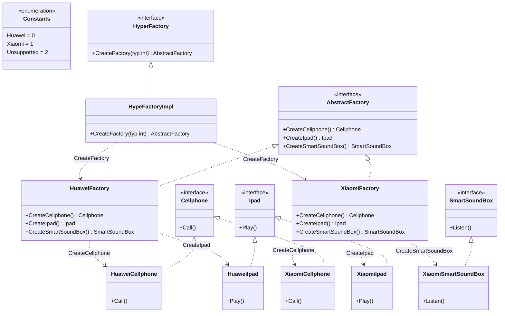

# 抽象工厂模式
抽象工厂模式用于生成产品族的工厂，所生成的对象是有关联的。

如果抽象工厂退化成生成的对象无关联则成为工厂函数模式。
## 工厂方法模式与抽象工厂模式的对比
| 工厂方法模式 | 抽象工厂模式 |
| --- | --- |
| 工厂方法模式针对的是一个产品等级结构 | 抽象工厂模式针对的是面向多个产品等级结构 |
| 一个抽象产品类 | 多个抽象产品类 |
| 可以派生出多个具体产品类 | 每个抽象产品类可以派生出多个具体产品类 |
| 一个抽象工厂类，可以派生出多个具体工厂类 | 一个抽象工厂类，可以派生出多个具体工厂类 |
| 每个具体工厂类只能创建一个具体产品类的实例 | 每个具体工厂类可以创建多个具体产品类的实例 |

区别在于产品，如果产品单一（即只有一个产品族），最合适用工厂方法模式，但是如果有多个业务品种、业务分类时，通过抽象工厂模式产生需要的对象是一种非常好的解决方式。

所以当抽象工厂退化成生成的对象无关联的或者单一的产品种类则成为工厂方法模式。

## 场景
现在有一个超级工厂，它负责创建实现了抽象工厂接口的工厂。抽象工厂接口一共有三个方法，分别对应创建了三个产品族，分别是手机产品族，Ipad产品族，只能音响产品族。一共又两个工厂实现了这个抽象工厂接口，分别是华为工厂和小米工厂，其中华为工厂不生产智能想音响产品族。

```golang 
package designpattern

import "fmt"

const (
	FactoryHuawei = iota
	FactoryXiaomi
	FactoryUnsupported
)

// 抽象工厂接口,需要能够生产手机和Ipad
type AbstractFactory interface {
	CreateCellphone() Cellphone
	CreateIpad() Ipad
	CreateSmartSoundBox() SmartSoundBox
}

// 超级工厂接口，创建一个工厂
type HyperFactory interface {
	CreateFactory(typ int) AbstractFactory
}

// 超级工厂实例
type HypeFactoryImpl struct{}

// 根据给定参数创建工厂
func (*HypeFactoryImpl) CreateFactory(typ int) AbstractFactory {
	switch typ {
	case FactoryHuawei:
		return &HuaweiFactory{}
	case FactoryXiaomi:
		return &XiaomiFactory{}
	default:
		return nil
	}
}

// 手机接口
type Cellphone interface {
	Call()
}

// Ipad接口
type Ipad interface {
	Play()
}

// 智能音箱接口
type SmartSoundBox interface {
	Listen()
}

// 华为工厂,实现了抽象工厂的两个接口
type HuaweiFactory struct{}

func (*HuaweiFactory) CreateCellphone() Cellphone {
	return &HuaweiCellphone{}
}

func (*HuaweiFactory) CreateIpad() Ipad {
	return &HuaweiIpad{}
}

// 华为工厂不生产智能音箱
func (*HuaweiFactory) CreateSmartSoundBox() SmartSoundBox {
	fmt.Println("Huawei not produce SmartSoundBox")
	return nil
}

// 华为手机，实现了手机接口
type HuaweiCellphone struct{}

func (*HuaweiCellphone) Call() {
	fmt.Println("I made a call on my HuaweiCellphone")
}

// 华为Ipad
type HuaweiIpad struct{}

func (*HuaweiIpad) Play() {
	fmt.Println("I am playing with HuaweiIpad")
}

// 小米工厂,实现了抽象工厂的两个接口
type XiaomiFactory struct{}

func (*XiaomiFactory) CreateCellphone() Cellphone {
	return &XiaomiCellphone{}
}

func (*XiaomiFactory) CreateIpad() Ipad {
	return &XiaomiIpad{}
}

func (*XiaomiFactory) CreateSmartSoundBox() SmartSoundBox {
	return &XiaomiSmartSoundBox{}
}

// 小米手机，实现了手机接口
type XiaomiCellphone struct{}

func (*XiaomiCellphone) Call() {
	fmt.Println("I made a call on my XiaomiCellphone")
}

// 小米Ipad
type XiaomiIpad struct{}

func (*XiaomiIpad) Play() {
	fmt.Println("I am playing with XiaomiIpad")
}

// 小米智能音箱
type XiaomiSmartSoundBox struct{}

func (*XiaomiSmartSoundBox) Listen() {
	fmt.Println("I am listening with XiaomiSmartSoundBox")
}

```

### 类图
