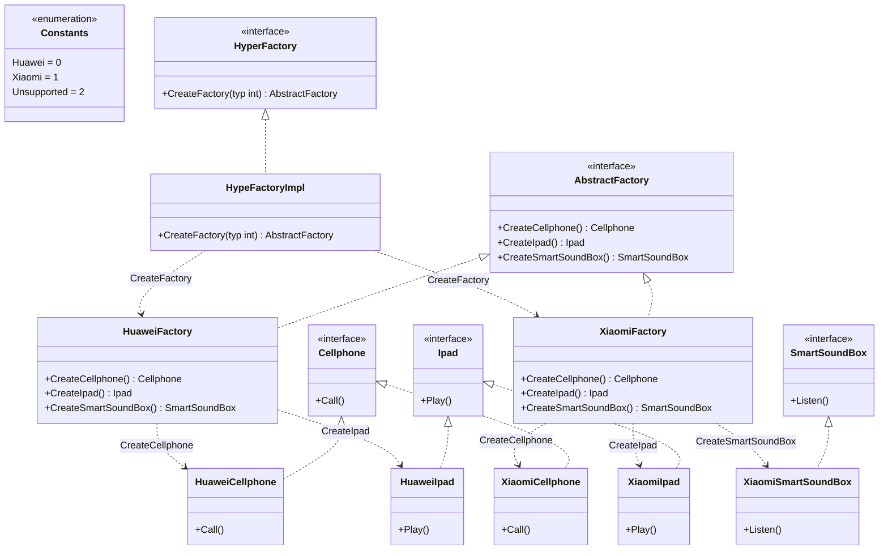

# 抽象工厂模式（Abstract Factory）
抽象工厂模式提供一个创建一系列相关或相互依赖对象的接口，而无需指定它们具体的类。这种模式属于创建型模式。

## 主要解决的问题
- 如何创建产品族
- 如何确保产品之间的兼容性
- 如何管理产品系列的创建
- 如何实现系统的可配置性

## 应用实例
1. GUI工具包的主题切换
2. 数据库访问层切换
3. 跨平台控件库
4. 游戏引擎的渲染系统

## 使用场景
1. 系统平台
   - 操作系统适配
   - 硬件驱动
   - 渲染引擎
2. 界面主题
   - 控件样式
   - 主题切换
   - 皮肤定制
3. 数据访问
   - 数据库切换
   - 存储方式
   - 协议适配
4. 框架实现
   - 插件系统
   - 中间件
   - 服务提供者

## 优缺点
### 优点
1. 产品一致性
   - 产品族兼容
   - 接口统一
2. 封装性好
   - 实现细节隐藏
   - 切换方便
3. 扩展性强
   - 易于增加产品族
   - 维护方便

### 缺点
1. 产品族扩展困难
   - 需要修改所有工厂
   - 违反开闭原则
2. 系统复杂度高
   - 类层次深
   - 理解难度大
3. 配置难度增加
   - 产品族选择
   - 初始化复杂

[原有的代码实现、使用示例和类图部分保持不变...]

## 说明
1. 抽象工厂的主要角色：
   - AbstractFactory（抽象工厂）：声明创建产品的接口
   - ConcreteFactory（具体工厂）：实现创建产品的接口
   - AbstractProduct（抽象产品）：定义产品的接口
   - ConcreteProduct（具体产品）：实现产品的接口
2. 实现要点：
   - 产品族的划分
   - 产品等级的设计
   - 工厂接口的定义
3. 设计考虑：
   - 是否需要产品缓存
   - 是否需要延迟初始化
   - 是否需要配置化
4. 相关模式：
   - 工厂方法：单个产品的创建
   - 单例模式：工厂的唯一实例
   - 原型模式：产品的克隆

```golang 
package designpattern

import "fmt"

const (
	FactoryHuawei = iota
	FactoryXiaomi
	FactoryUnsupported
)

// 抽象工厂接口,需要能够生产手机和Ipad
type AbstractFactory interface {
	CreateCellphone() Cellphone
	CreateIpad() Ipad
	CreateSmartSoundBox() SmartSoundBox
}

// 超级工厂接口，创建一个工厂
type HyperFactory interface {
	CreateFactory(typ int) AbstractFactory
}

// 超级工厂实例
type HypeFactoryImpl struct{}

// 根据给定参数创建工厂
func (*HypeFactoryImpl) CreateFactory(typ int) AbstractFactory {
	switch typ {
	case FactoryHuawei:
		return &HuaweiFactory{}
	case FactoryXiaomi:
		return &XiaomiFactory{}
	default:
		return nil
	}
}

// 手机接口
type Cellphone interface {
	Call()
}

// Ipad接口
type Ipad interface {
	Play()
}

// 智能音箱接口
type SmartSoundBox interface {
	Listen()
}

// 华为工厂,实现了抽象工厂的两个接口
type HuaweiFactory struct{}

func (*HuaweiFactory) CreateCellphone() Cellphone {
	return &HuaweiCellphone{}
}

func (*HuaweiFactory) CreateIpad() Ipad {
	return &HuaweiIpad{}
}

// 华为工厂不生产智能音箱
func (*HuaweiFactory) CreateSmartSoundBox() SmartSoundBox {
	fmt.Println("Huawei not produce SmartSoundBox")
	return nil
}

// 华为手机，实现了手机接口
type HuaweiCellphone struct{}

func (*HuaweiCellphone) Call() {
	fmt.Println("I made a call on my HuaweiCellphone")
}

// 华为Ipad
type HuaweiIpad struct{}

func (*HuaweiIpad) Play() {
	fmt.Println("I am playing with HuaweiIpad")
}

// 小米工厂,实现了抽象工厂的两个接口
type XiaomiFactory struct{}

func (*XiaomiFactory) CreateCellphone() Cellphone {
	return &XiaomiCellphone{}
}

func (*XiaomiFactory) CreateIpad() Ipad {
	return &XiaomiIpad{}
}

func (*XiaomiFactory) CreateSmartSoundBox() SmartSoundBox {
	return &XiaomiSmartSoundBox{}
}

// 小米手机，实现了手机接口
type XiaomiCellphone struct{}

func (*XiaomiCellphone) Call() {
	fmt.Println("I made a call on my XiaomiCellphone")
}

// 小米Ipad
type XiaomiIpad struct{}

func (*XiaomiIpad) Play() {
	fmt.Println("I am playing with XiaomiIpad")
}

// 小米智能音箱
type XiaomiSmartSoundBox struct{}

func (*XiaomiSmartSoundBox) Listen() {
	fmt.Println("I am listening with XiaomiSmartSoundBox")
}

```

### 类图
