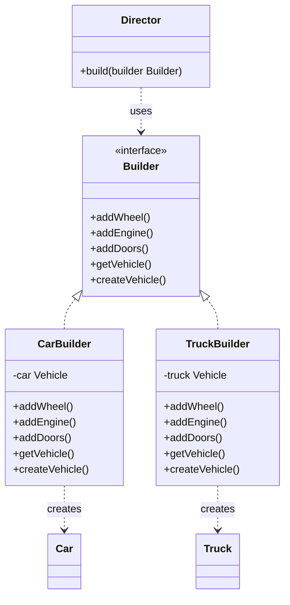

# 建造者模式
建造者模式将一个复杂对象的构建与它的表示分离，使得同样的构建过程可以创建不同的表示。

建造者模式是一步一步创建一个复杂的对象，它允许用户只通过指定复杂对象的类型和内容就可以构建它们，用户不需要知道内部的具体构建细节。

## 代码实现

```golang
package designpattern

// Builder 是生成器接口
type Builder interface {
	AddWheel()
	AddEngine()
	AddDoors()
	GetVehicle() Vehicle
	CreateVehicle()
}

// Director 是指挥者
type Director struct{}

// Build 使用生成器构建
func (d *Director) Build(builder Builder) {
	builder.CreateVehicle()
	builder.AddWheel()
	builder.AddEngine()
	builder.AddDoors()
}

// CarBuilder 是汽车生成器
type CarBuilder struct {
	car Vehicle
}

func (b *CarBuilder) AddWheel() {
	b.car.AddPart("Car Wheel")
}

func (b *CarBuilder) AddEngine() {
	b.car.AddPart("Car Engine")
}

func (b *CarBuilder) AddDoors() {
	b.car.AddPart("Car Doors")
}

func (b *CarBuilder) GetVehicle() Vehicle {
	return b.car
}

func (b *CarBuilder) CreateVehicle() {
	b.car = &Car{}
}

// TruckBuilder 是卡车生成器
type TruckBuilder struct {
	truck Vehicle
}

func (b *TruckBuilder) AddWheel() {
	b.truck.AddPart("Truck Engine")
}

func (b *TruckBuilder) AddEngine() {
	b.truck.AddPart("Truck Engine")
}

func (b *TruckBuilder) AddDoors() {
	b.truck.AddPart("Truck Doors")
}

func (b *TruckBuilder) GetVehicle() Vehicle {
	return b.truck
}

func (b *TruckBuilder) CreateVehicle() {
	b.truck = &Truck{}
}

// Vehicle 是车辆接口
type Vehicle interface {
	AddPart(part string)
}

// Car 是具体的汽车
type Car struct {
	parts []string
}

func (c *Car) AddPart(part string) {
	c.parts = append(c.parts, part)
}

// Truck 是具体的卡车
type Truck struct {
	parts []string
}

func (t *Truck) AddPart(part string) {
	t.parts = append(t.parts, part)
}
```

## 使用示例

```golang
func main() {
    director := &Director{}
    
    // 构建汽车
    carBuilder := &CarBuilder{}
    director.build(carBuilder)
    car := carBuilder.getVehicle()
    
    // 构建卡车
    truckBuilder := &TruckBuilder{}
    director.build(truckBuilder)
    truck := truckBuilder.getVehicle()
}
```

## 类图


## 说明
1. Builder 接口定义了构建产品需要的所有方法
2. Director 指挥者负责使用 Builder 构建产品
3. CarBuilder 和 TruckBuilder 是具体的建造者，实现了 Builder 接口
4. 建造者模式将复杂对象的构建过程封装起来，使得构建过程和表示分离
5. 同样的构建过程可以创建不同的表示（汽车或卡车）
6. 使用者不需要知道具体的构建细节，只需要知道想要什么类型的产品
