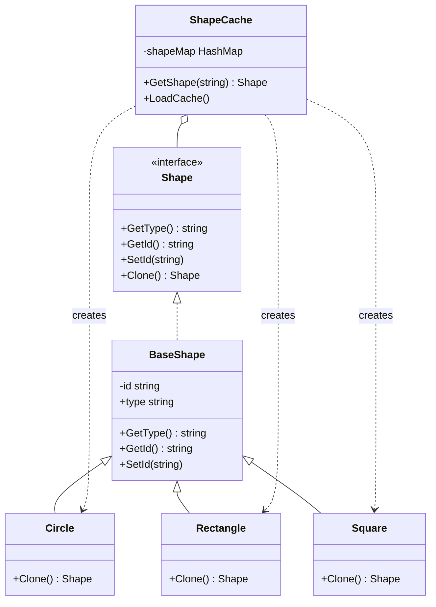

# 原型模式（Prototype）
原型模式（Prototype Pattern）是用于创建重复的对象，同时又能保证性能。这种类型的设计模式属于创建型模式，它提供了一种创建对象的最佳方式之一。使对象能复制自身，并且暴露到接口中，使客户端面向接口编程时，不知道接口实际对象的情况下生成新的对象。

原型模式配合原型管理器使用，使得客户端在不知道具体类的情况下，通过接口管理器得到新的实例，并且包含部分预设定配置。


## 示例

这种模式是实现了一个原型接口，该接口用于创建当前对象的克隆。当直接创建对象的代价比较大时，则采用这种模式。例如，一个对象需要在一个高代价的数据库操作之后被创建。我们可以缓存该对象，在下一个请求时返回它的克隆，在需要的时候更新数据库，以此来减少数据库调用。


## 代码实现

```golang
package designpattern

// Shape 是形状接口
type Shape interface {
    GetType() string
    GetId() string
    SetId(id string)
    Clone() Shape
}

// BaseShape 提供基础实现
type BaseShape struct {
    id   string
    typ  string
}

func (s *BaseShape) GetType() string {
    return s.typ
}

func (s *BaseShape) GetId() string {
    return s.id
}

func (s *BaseShape) SetId(id string) {
    s.id = id
}

// Circle 实现
type Circle struct {
    BaseShape
}

func NewCircle() *Circle {
    return &Circle{
        BaseShape: BaseShape{typ: "Circle"},
    }
}

func (c *Circle) Clone() Shape {
    return &Circle{
        BaseShape: BaseShape{
            id:  c.id,
            typ: c.typ,
        },
    }
}

// Rectangle 实现
type Rectangle struct {
    BaseShape
}

func NewRectangle() *Rectangle {
    return &Rectangle{
        BaseShape: BaseShape{typ: "Rectangle"},
    }
}

func (r *Rectangle) Clone() Shape {
    return &Rectangle{
        BaseShape: BaseShape{
            id:  r.id,
            typ: r.typ,
        },
    }
}

// Square 实现
type Square struct {
    BaseShape
}

func NewSquare() *Square {
    return &Square{
        BaseShape: BaseShape{typ: "Square"},
    }
}

func (s *Square) Clone() Shape {
    return &Square{
        BaseShape: BaseShape{
            id:  s.id,
            typ: s.typ,
        },
    }
}

// ShapeCache 形状缓存管理器
type ShapeCache struct {
    shapeMap map[string]Shape
}

func NewShapeCache() *ShapeCache {
    return &ShapeCache{
        shapeMap: make(map[string]Shape),
    }
}

func (c *ShapeCache) GetShape(id string) Shape {
    cachedShape := c.shapeMap[id]
    return cachedShape.Clone()
}

func (c *ShapeCache) LoadCache() {
    circle := NewCircle()
    circle.SetId("1")
    c.shapeMap[circle.GetId()] = circle

    square := NewSquare()
    square.SetId("2")
    c.shapeMap[square.GetId()] = square

    rectangle := NewRectangle()
    rectangle.SetId("3")
    c.shapeMap[rectangle.GetId()] = rectangle
}
```

## 使用示例

```golang
func main() {
    cache := NewShapeCache()
    cache.LoadCache()

    // 克隆形状
    shape1 := cache.GetShape("1")
    shape2 := cache.GetShape("2")
    shape3 := cache.GetShape("3")
}
```

## 类图


## 说明
1. Cloneable 接口定义了克隆方法
2. PrototypeManager 是原型管理器，负责原型的注册和克隆
3. Type1 和 Type2 是具体的原型实现
4. 原型模式通过克隆来创建对象，而不是通过 new
5. 原型管理器使得客户端可以通过名字来获取克隆对象
6. 克隆可以是浅拷贝或深拷贝，具体根据需求实现

