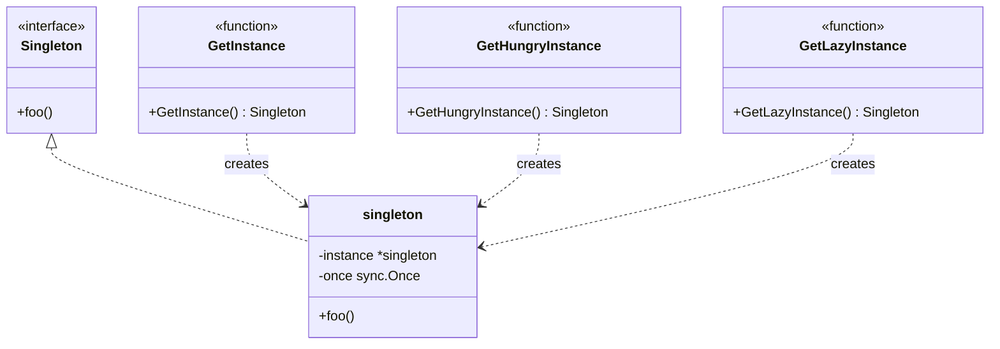

# 单例模式（Singleton）
单例模式确保一个类只有一个实例，并提供一个全局访问点。单例模式常用于管理共享资源、控制资源的访问。

## 示例
1. 数据库连接池
2. 配置管理器
3. 日志管理器
4. 线程池

## 代码实现

```golang
package designpattern

import "sync"

/*
===========================
    1. 通用单例实现
===========================
*/
// Singleton 是单例模式接口
type Singleton interface {
    foo()
}

// singleton 是单例模式实现
type singleton struct{}

func (s *singleton) foo() {}

var (
    instance *singleton
    once     sync.Once
)

// GetInstance 用于获取单例模式对象
func GetInstance() Singleton {
    once.Do(func() {
        instance = &singleton{}
    })
    return instance
}

/*
===========================
    2. 饿汉式实现
===========================
*/

var hungryInstance = &singleton{}

// GetHungryInstance 饿汉式单例
func GetHungryInstance() Singleton {
    return hungryInstance
}

/* 
===========================
    3. 懒汉式实现（双重检查）
===========================
*/

var (
    lazyInstance *singleton
    mu          sync.Mutex
)

// GetLazyInstance 懒汉式单例
func GetLazyInstance() Singleton {
    if lazyInstance == nil {
        mu.Lock()
        defer mu.Unlock()
        if lazyInstance == nil {
            lazyInstance = &singleton{}
        }
    }
    return lazyInstance
}
```

## 使用示例

```golang
func main() {
    // 1. 使用 sync.Once 的实现
    instance1 := GetInstance()
    instance2 := GetInstance()
    // instance1 == instance2 总是成立
    
    // 2. 饿汉式
    hungry1 := GetHungryInstance()
    hungry2 := GetHungryInstance()
    // hungry1 == hungry2 总是成立
    
    // 3. 懒汉式
    lazy1 := GetLazyInstance()
    lazy2 := GetLazyInstance()
    // lazy1 == lazy2 总是成立
}
```

## 类图


## 说明
1. 提供了三种单例模式的实现：
   - 使用 sync.Once 的线程安全实现（推荐）
   - 饿汉式实现（启动时初始化）
   - 懒汉式实现（双重检查锁）
2. sync.Once 保证初始化函数只执行一次
3. 饿汉式在包初始化时就创建实例，避免了并发问题
4. 懒汉式在首次使用时创建实例，使用互斥锁保证并发安全
5. 所有实现都保证全局只有一个实例
6. Go语言推荐使用 sync.Once 实现单例模式

## Go语言中的单例模式应用

### 1. 数据库连接池

```golang
type DBConnection struct {
    // 数据库连接配置
}

var (
    dbInstance *DBConnection
    dbOnce     sync.Once
)

func GetDBConnection() *DBConnection {
    dbOnce.Do(func() {
        dbInstance = &DBConnection{
            // 初始化数据库连接
        }
    })
    return dbInstance
}
```

### 2. 配置管理器

```golang
type Config struct {
    settings map[string]interface{}
    mu       sync.RWMutex
}

var (
    configInstance *Config
    configOnce     sync.Once
)

func GetConfig() *Config {
    configOnce.Do(func() {
        configInstance = &Config{
            settings: make(map[string]interface{}),
        }
        // 加载配置文件
    })
    return configInstance
}

func (c *Config) Get(key string) interface{} {
    c.mu.RLock()
    defer c.mu.RUnlock()
    return c.settings[key]
}

func (c *Config) Set(key string, value interface{}) {
    c.mu.Lock()
    defer c.mu.Unlock()
    c.settings[key] = value
}
```

### 3. 日志管理器

```golang
type Logger struct {
    file *os.File
    mu   sync.Mutex
}

var (
    loggerInstance *Logger
    loggerOnce     sync.Once
)

func GetLogger() *Logger {
    loggerOnce.Do(func() {
        loggerInstance = &Logger{
            // 初始化日志文件
        }
    })
    return loggerInstance
}

func (l *Logger) Log(message string) {
    l.mu.Lock()
    defer l.mu.Unlock()
    // 写入日志
}
```

### 4. 应用状态管理

```golang
type AppState struct {
    state map[string]interface{}
    mu    sync.RWMutex
}

var (
    stateInstance *AppState
    stateOnce     sync.Once
)

func GetAppState() *AppState {
    stateOnce.Do(func() {
        stateInstance = &AppState{
            state: make(map[string]interface{}),
        }
    })
    return stateInstance
}

func (a *AppState) GetState(key string) interface{} {
    a.mu.RLock()
    defer a.mu.RUnlock()
    return a.state[key]
}

func (a *AppState) SetState(key string, value interface{}) {
    a.mu.Lock()
    defer a.mu.Unlock()
    a.state[key] = value
}
```

## 最佳实践

1. **使用 sync.Once**
   - 保证线程安全
   - 避免双重检查锁定的复杂性
   - 确保初始化代码只执行一次

2. **并发安全**
   - 对共享资源的访问使用互斥锁
   - 读多写少的场景使用读写锁
   - 避免竞态条件

3. **延迟初始化**
   - 只在首次使用时初始化
   - 避免启动时的资源浪费
   - 处理初始化失败的情况

4. **资源清理**
   - 实现 Close 或 Shutdown 方法
   - 正确处理资源释放
   - 考虑优雅关闭的场景

5. **测试友好**
   - 提供重置单例的方法（仅用于测试）
   - 使用接口而不是具体类型
   - 方便进行单元测试

```golang
// 测试辅助函数示例
func ResetForTest() {
    instance = nil
    once = sync.Once{}
}
```

## 注意事项

1. 避免过度使用单例模式
2. 考虑使用依赖注入作为替代方案
3. 确保单例的状态是线程安全的
4. 注意初始化顺序和依赖关系
5. 在测试中要特别注意单例的重置
