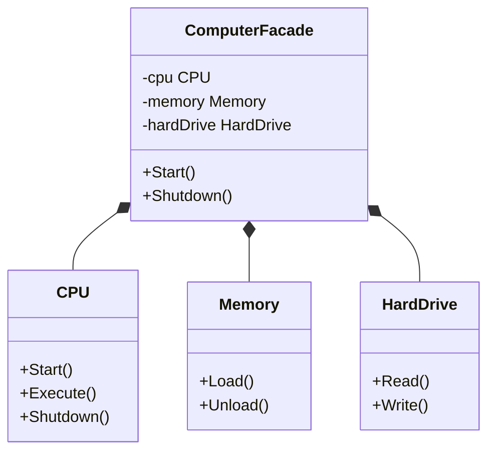

# 外观模式（Facade）

外观模式（Facade Pattern）隐藏系统的复杂性，并向客户端提供了一个客户端可以访问系统的接口。这种类型的设计模式属于结构型模式，它向现有的系统添加一个接口，来隐藏系统的复杂性。

这种模式涉及到一个单一的类，该类提供了客户端请求的简化方法和对现有系统类方法的委托调用。

外观模式提供了一个统一的接口，用来访问子系统中的一群接口。外观定义了一个高层接口，让子系统更容易使用。它为子系统中的一组接口提供一个统一的高层接口，使得子系统更容易使用。
## 示例
1. 复杂系统的简化接口
2. 子系统的统一访问点
3. 解耦客户端与子系统
4. 分层设计中的中间层

## 代码实现

```golang
package designpattern

// 子系统1：CPU
type CPU struct{}

func (c *CPU) Start() {
    println("CPU is starting")
}

func (c *CPU) Execute() {
    println("CPU is executing")
}

func (c *CPU) Shutdown() {
    println("CPU is shutting down")
}

// 子系统2：Memory
type Memory struct{}

func (m *Memory) Load() {
    println("Memory is loading")
}

func (m *Memory) Unload() {
    println("Memory is unloading")
}

// 子系统3：HardDrive
type HardDrive struct{}

func (h *HardDrive) Read() {
    println("HardDrive is reading")
}

func (h *HardDrive) Write() {
    println("HardDrive is writing")
}

// ComputerFacade 提供了一个统一的接口
type ComputerFacade struct {
    cpu       *CPU
    memory    *Memory
    hardDrive *HardDrive
}

// NewComputerFacade 创建外观
func NewComputerFacade() *ComputerFacade {
    return &ComputerFacade{
        cpu:       &CPU{},
        memory:    &Memory{},
        hardDrive: &HardDrive{},
    }
}

// Start 提供了一个简单的接口来启动计算机
func (c *ComputerFacade) Start() {
    c.cpu.Start()
    c.memory.Load()
    c.hardDrive.Read()
    c.cpu.Execute()
}

// Shutdown 提供了一个简单的接口来关闭计算机
func (c *ComputerFacade) Shutdown() {
    c.cpu.Shutdown()
    c.memory.Unload()
}
```

## 使用示例

```golang
func main() {
    computer := NewComputerFacade()
    
    // 启动计算机
    computer.Start()
    
    // 关闭计算机
    computer.Shutdown()
}
```

## 类图


## 说明
1. 外观模式提供了一个简单的接口来操作复杂的子系统
2. 子系统的复杂性被隐藏在外观类后面
3. 客户端只需要与外观类交互
4. 降低了系统的耦合度
5. 不会限制客户端直接访问子系统