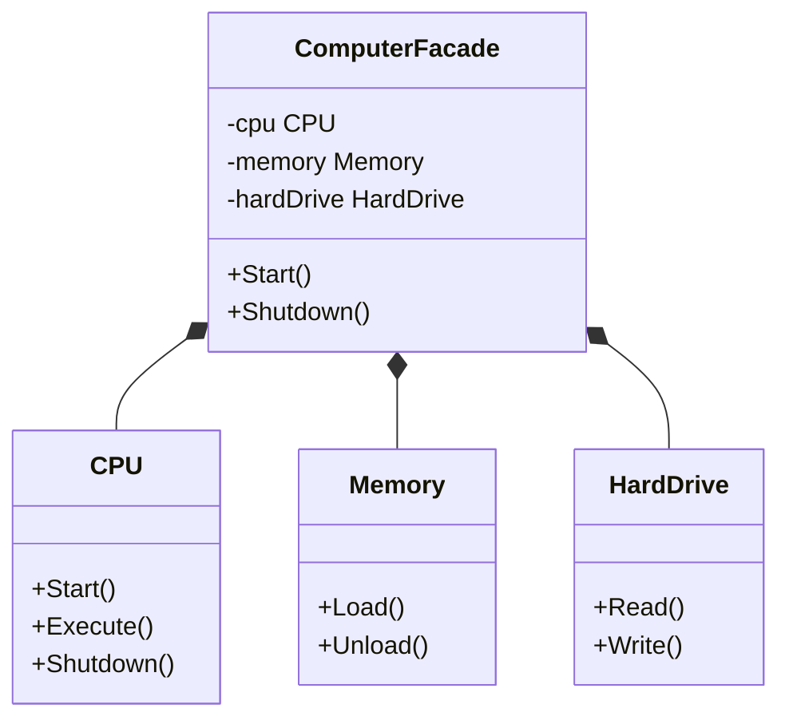

# 外观模式（Facade）
外观模式提供了一个统一的接口，用来访问子系统中的一群接口。外观定义了一个高层接口，让子系统更容易使用。这种模式属于结构型模式。

## 主要解决的问题
- 如何简化复杂子系统的访问
- 如何解耦客户端与子系统
- 如何提供统一的接口
- 如何降低系统的耦合度

## 应用实例
1. Spring的JdbcTemplate
2. SLF4J日志门面
3. 编译器的前端接口
4. 操作系统的API

## 使用场景
1. 系统集成
   - 遗留系统整合
   - 第三方库封装
   - 服务聚合
2. 接口简化
   - API网关
   - 服务门面
   - 统一接口
3. 系统解耦
   - 模块分离
   - 接口隔离
   - 依赖管理
4. 性能优化
   - 请求合并
   - 缓存管理
   - 并发控制

## 优缺点
### 优点
1. 简化接口
   - 统一访问点
   - 易于使用
2. 松耦合
   - 客户端解耦
   - 实现分离
3. 灵活性高
   - 易于扩展
   - 维护方便

### 缺点
1. 不符合开闭
   - 修改困难
   - 扩展受限
2. 过度简化
   - 功能受限
   - 灵活性降低
3. 性能损失
   - 额外层次
   - 转发开销

## 示例
1. 复杂系统的简化接口
2. 子系统的统一访问点
3. 解耦客户端与子系统
4. 分层设计中的中间层

## 代码实现

```golang
package designpattern

// 子系统1：CPU
type CPU struct{}

func (c *CPU) Start() {
    println("CPU is starting")
}

func (c *CPU) Execute() {
    println("CPU is executing")
}

func (c *CPU) Shutdown() {
    println("CPU is shutting down")
}

// 子系统2：Memory
type Memory struct{}

func (m *Memory) Load() {
    println("Memory is loading")
}

func (m *Memory) Unload() {
    println("Memory is unloading")
}

// 子系统3：HardDrive
type HardDrive struct{}

func (h *HardDrive) Read() {
    println("HardDrive is reading")
}

func (h *HardDrive) Write() {
    println("HardDrive is writing")
}

// ComputerFacade 提供了一个统一的接口
type ComputerFacade struct {
    cpu       *CPU
    memory    *Memory
    hardDrive *HardDrive
}

// NewComputerFacade 创建外观
func NewComputerFacade() *ComputerFacade {
    return &ComputerFacade{
        cpu:       &CPU{},
        memory:    &Memory{},
        hardDrive: &HardDrive{},
    }
}

// Start 提供了一个简单的接口来启动计算机
func (c *ComputerFacade) Start() {
    c.cpu.Start()
    c.memory.Load()
    c.hardDrive.Read()
    c.cpu.Execute()
}

// Shutdown 提供了一个简单的接口来关闭计算机
func (c *ComputerFacade) Shutdown() {
    c.cpu.Shutdown()
    c.memory.Unload()
}
```

## 使用示例

```golang
func main() {
    computer := NewComputerFacade()
    
    // 启动计算机
    computer.Start()
    
    // 关闭计算机
    computer.Shutdown()
}
```

## 类图


## 说明
1. 外观模式的主要角色：
   - Facade（外观）：知道哪些子系统负责处理请求
   - SubSystem（子系统）：实现子系统的功能
   - Client（客户端）：通过外观访问子系统
2. 实现要点：
   - 接口设计简单化
   - 子系统组合方式
   - 请求转发策略
3. 设计考虑：
   - 是否需要抽象外观
   - 是否需要子系统缓存
   - 是否需要权限控制
4. 相关模式：
   - 单例模式：外观对象
   - 代理模式：访问控制
   - 适配器模式：接口转换