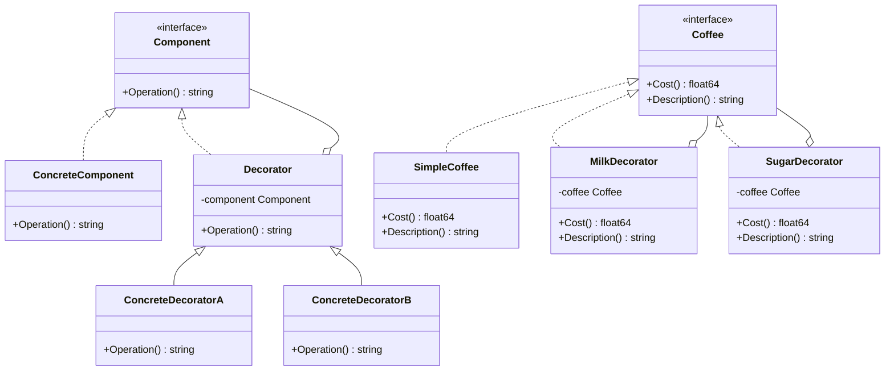

# 装饰器模式（Decorator）
装饰器模式允许向一个现有的对象添加新的功能，同时又不改变其结构。这种类型的设计模式属于结构型模式，它是作为现有的类的一个包装。

## 主要解决的问题
- 如何在不改变现有对象的情况下动态地添加功能
- 如何实现功能的动态组合和叠加
- 如何避免继承带来的类爆炸问题
- 如何保持类的单一职责原则

## 应用实例
1. Java I/O流的设计
2. Spring的TransactionProxy
3. Python的@decorator语法
4. Golang的http.Handler中间件

## 使用场景
1. 数据处理流
   - 数据压缩
   - 数据加密
   - 数据校验
2. 界面组件
   - 边框修饰
   - 滚动条装饰
   - 颜色样式
3. 功能增强
   - 日志记录
   - 性能监控
   - 访问控制
4. 中间件
   - Web过滤器
   - 认证授权
   - 缓存处理

## 优缺点
### 优点
1. 灵活性高
   - 动态添加功能
   - 功能可自由组合
2. 符合开闭原则
   - 不修改原有代码
   - 易于扩展新功能
3. 遵循单一职责
   - 每个装饰器专注特定功能
   - 避免类的膨胀

### 缺点
1. 复杂度增加
   - 装饰器类数量多
   - 排查问题困难
2. 顺序敏感
   - 装饰顺序可能影响结果
   - 需要考虑组合的正确性
3. 使用成本
   - 需要更多的代码
   - 理解和维护成本高

## 代码实现

```golang
package designpattern

// Component 定义了可以动态添加职责的对象接口
type Component interface {
    Operation() string
}

// ConcreteComponent 定义了一个具体的对象，可以给这个对象添加职责
type ConcreteComponent struct{}

func (c *ConcreteComponent) Operation() string {
    return "ConcreteComponent"
}

// Decorator 装饰器抽象类
type Decorator struct {
    component Component
}

func (d *Decorator) Operation() string {
    if d.component != nil {
        return d.component.Operation()
    }
    return ""
}

// ConcreteDecoratorA 具体的装饰器A
type ConcreteDecoratorA struct {
    Decorator
}

func NewConcreteDecoratorA(c Component) *ConcreteDecoratorA {
    return &ConcreteDecoratorA{Decorator{component: c}}
}

func (d *ConcreteDecoratorA) Operation() string {
    return "ConcreteDecoratorA(" + d.Decorator.Operation() + ")"
}

// ConcreteDecoratorB 具体的装饰器B
type ConcreteDecoratorB struct {
    Decorator
}

func NewConcreteDecoratorB(c Component) *ConcreteDecoratorB {
    return &ConcreteDecoratorB{Decorator{component: c}}
}

func (d *ConcreteDecoratorB) Operation() string {
    return "ConcreteDecoratorB(" + d.Decorator.Operation() + ")"
}

// 实际应用示例：咖啡订单系统
type Coffee interface {
    Cost() float64
    Description() string
}

type SimpleCoffee struct{}

func (c *SimpleCoffee) Cost() float64 {
    return 1.0
}

func (c *SimpleCoffee) Description() string {
    return "Simple coffee"
}

type MilkDecorator struct {
    coffee Coffee
}

func NewMilkDecorator(c Coffee) *MilkDecorator {
    return &MilkDecorator{coffee: c}
}

func (d *MilkDecorator) Cost() float64 {
    return d.coffee.Cost() + 0.5
}

func (d *MilkDecorator) Description() string {
    return d.coffee.Description() + ", milk"
}

type SugarDecorator struct {
    coffee Coffee
}

func NewSugarDecorator(c Coffee) *SugarDecorator {
    return &SugarDecorator{coffee: c}
}

func (d *SugarDecorator) Cost() float64 {
    return d.coffee.Cost() + 0.2
}

func (d *SugarDecorator) Description() string {
    return d.coffee.Description() + ", sugar"
}
```

## 使用示例

```golang
func main() {
    // 基本装饰器示例
    component := &ConcreteComponent{}
    decoratorA := NewConcreteDecoratorA(component)
    decoratorB := NewConcreteDecoratorB(decoratorA)
    
    fmt.Println(decoratorB.Operation())
    
    // 咖啡订单示例
    coffee := &SimpleCoffee{}
    coffeeWithMilk := NewMilkDecorator(coffee)
    coffeeWithMilkAndSugar := NewSugarDecorator(coffeeWithMilk)
    
    fmt.Printf("Cost: %.2f\n", coffeeWithMilkAndSugar.Cost())
    fmt.Println("Description:", coffeeWithMilkAndSugar.Description())
}
```

## 类图


## 说明
1. 装饰器模式的主要角色：
   - Component（组件）：定义原始对象和装饰器的共同接口
   - ConcreteComponent（具体组件）：需要被装饰的原始对象
   - Decorator（装饰器）：持有一个Component对象的引用
   - ConcreteDecorator（具体装饰器）：负责添加新的功能
2. 实现要点：
   - 装饰器接口设计
   - 装饰器链的管理
   - 状态保持的处理
3. 设计考虑：
   - 是否需要抽象装饰器类
   - 是否需要保持装饰顺序
   - 是否需要撤销装饰
4. 相关模式：
   - 代理模式：不同的职责
   - 组合模式：不同的结构
   - 策略模式：不同的算法
