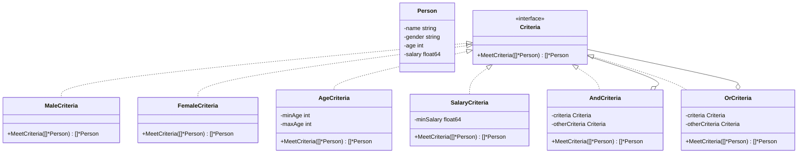

# 过滤器模式（Filter/Criteria）
过滤器模式允许开发人员使用不同的标准来过滤一组对象，通过逻辑运算以解耦的方式把它们连接起来。这种模式也被称为标准模式（Criteria Pattern）。

## 主要解决的问题
- 如何对一组对象进行灵活的过滤
- 如何组合多个过滤条件
- 如何动态添加新的过滤规则
- 如何保持过滤规则的可复用性

## 应用实例
1. Spring Security的过滤器链
2. Servlet的Filter机制
3. ORM框架的查询条件构建
4. 日志过滤系统

## 使用场景
1. 数据查询
   - 复杂条件查询
   - 动态条件组合
   - 数据筛选
2. 权限控制
   - 用户权限过滤
   - 数据访问控制
   - 内容过滤
3. 日志处理
   - 日志级别过滤
   - 日志类型筛选
   - 日志内容过滤
4. Web应用
   - 请求过滤
   - 响应处理
   - 内容过滤

## 优缺点
### 优点
1. 灵活性高
   - 过滤规则可组合
   - 易于扩展新规则
2. 复用性好
   - 过滤器可重复使用
   - 规则可独立维护
3. 结构清晰
   - 职责单一
   - 逻辑分明

### 缺点
1. 性能开销
   - 过滤链过长影响性能
   - 复杂组合可能降低效率
2. 复杂度增加
   - 过滤规则需要维护
   - 组合逻辑需要管理
3. 调试困难
   - 链式调用难以调试
   - 错误定位复杂

## 代码实现

```golang
package designpattern

// Person 定义人员结构
type Person struct {
    name   string
    gender string
    age    int
    salary float64
}

func NewPerson(name string, gender string, age int, salary float64) *Person {
    return &Person{
        name:   name,
        gender: gender,
        age:    age,
        salary: salary,
    }
}

// Criteria 定义过滤器接口
type Criteria interface {
    MeetCriteria(persons []*Person) []*Person
}

// MaleCriteria 男性过滤器
type MaleCriteria struct{}

func (c *MaleCriteria) MeetCriteria(persons []*Person) []*Person {
    filtered := make([]*Person, 0)
    for _, person := range persons {
        if person.gender == "Male" {
            filtered = append(filtered, person)
        }
    }
    return filtered
}

// FemaleCriteria 女性过滤器
type FemaleCriteria struct{}

func (c *FemaleCriteria) MeetCriteria(persons []*Person) []*Person {
    filtered := make([]*Person, 0)
    for _, person := range persons {
        if person.gender == "Female" {
            filtered = append(filtered, person)
        }
    }
    return filtered
}

// AgeCriteria 年龄过滤器
type AgeCriteria struct {
    minAge int
    maxAge int
}

func NewAgeCriteria(minAge, maxAge int) *AgeCriteria {
    return &AgeCriteria{
        minAge: minAge,
        maxAge: maxAge,
    }
}

func (c *AgeCriteria) MeetCriteria(persons []*Person) []*Person {
    filtered := make([]*Person, 0)
    for _, person := range persons {
        if person.age >= c.minAge && person.age <= c.maxAge {
            filtered = append(filtered, person)
        }
    }
    return filtered
}

// SalaryCriteria 薪资过滤器
type SalaryCriteria struct {
    minSalary float64
}

func NewSalaryCriteria(minSalary float64) *SalaryCriteria {
    return &SalaryCriteria{minSalary: minSalary}
}

func (c *SalaryCriteria) MeetCriteria(persons []*Person) []*Person {
    filtered := make([]*Person, 0)
    for _, person := range persons {
        if person.salary >= c.minSalary {
            filtered = append(filtered, person)
        }
    }
    return filtered
}

// AndCriteria 组合过滤器（与）
type AndCriteria struct {
    criteria      Criteria
    otherCriteria Criteria
}

func NewAndCriteria(criteria Criteria, otherCriteria Criteria) *AndCriteria {
    return &AndCriteria{
        criteria:      criteria,
        otherCriteria: otherCriteria,
    }
}

func (c *AndCriteria) MeetCriteria(persons []*Person) []*Person {
    firstCriteriaPersons := c.criteria.MeetCriteria(persons)
    return c.otherCriteria.MeetCriteria(firstCriteriaPersons)
}

// OrCriteria 组合过滤器（或）
type OrCriteria struct {
    criteria      Criteria
    otherCriteria Criteria
}

func NewOrCriteria(criteria Criteria, otherCriteria Criteria) *OrCriteria {
    return &OrCriteria{
        criteria:      criteria,
        otherCriteria: otherCriteria,
    }
}

func (c *OrCriteria) MeetCriteria(persons []*Person) []*Person {
    firstCriteriaItems := c.criteria.MeetCriteria(persons)
    otherCriteriaItems := c.otherCriteria.MeetCriteria(persons)
    
    for _, person := range otherCriteriaItems {
        if !containsPerson(firstCriteriaItems, person) {
            firstCriteriaItems = append(firstCriteriaItems, person)
        }
    }
    return firstCriteriaItems
}

// 辅助函数：检查列表是否包含特定人员
func containsPerson(persons []*Person, person *Person) bool {
    for _, p := range persons {
        if p == person {
            return true
        }
    }
    return false
}
```

## 使用示例

```golang
func main() {
    persons := []*Person{
        NewPerson("John", "Male", 25, 3000),
        NewPerson("Alice", "Female", 30, 4000),
        NewPerson("Bob", "Male", 35, 5000),
        NewPerson("Emma", "Female", 28, 3500),
        NewPerson("Mike", "Male", 22, 2500),
    }
    
    male := &MaleCriteria{}
    female := &FemaleCriteria{}
    ageRange := NewAgeCriteria(25, 35)
    highSalary := NewSalaryCriteria(4000)
    
    // 查找所有男性
    malePersons := male.MeetCriteria(persons)
    fmt.Println("Males:")
    for _, person := range malePersons {
        fmt.Printf("Name: %s, Gender: %s\n", person.name, person.gender)
    }
    
    // 查找年龄在25-35之间且薪资高于4000的人
    ageAndSalary := NewAndCriteria(ageRange, highSalary)
    result := ageAndSalary.MeetCriteria(persons)
    fmt.Println("\nAge between 25-35 and high salary:")
    for _, person := range result {
        fmt.Printf("Name: %s, Age: %d, Salary: %.2f\n", 
            person.name, person.age, person.salary)
    }
    
    // 查找女性或高薪资的人
    femaleOrHighSalary := NewOrCriteria(female, highSalary)
    result = femaleOrHighSalary.MeetCriteria(persons)
    fmt.Println("\nFemales or high salary:")
    for _, person := range result {
        fmt.Printf("Name: %s, Gender: %s, Salary: %.2f\n", 
            person.name, person.gender, person.salary)
    }
}
```

## 类图


## 说明
1. 过滤器模式的主要角色：
   - Criteria（标准）：定义过滤接口
   - ConcreteCriteria（具体标准）：实现具体的过滤规则
   - CriteriaChain（标准链）：组合多个过滤器
   - Target（目标）：被过滤的对象
2. 实现要点：
   - 过滤器接口设计
   - 过滤规则的组合
   - 过滤链的执行顺序
3. 设计考虑：
   - 是否需要支持并行过滤
   - 是否需要过滤器的优先级
   - 是否需要过滤结果的缓存
4. 相关模式：
   - 责任链模式：处理请求的链式结构
   - 组合模式：组合过滤规则
   - 策略模式：不同的过滤算法
</rewritten_file>
