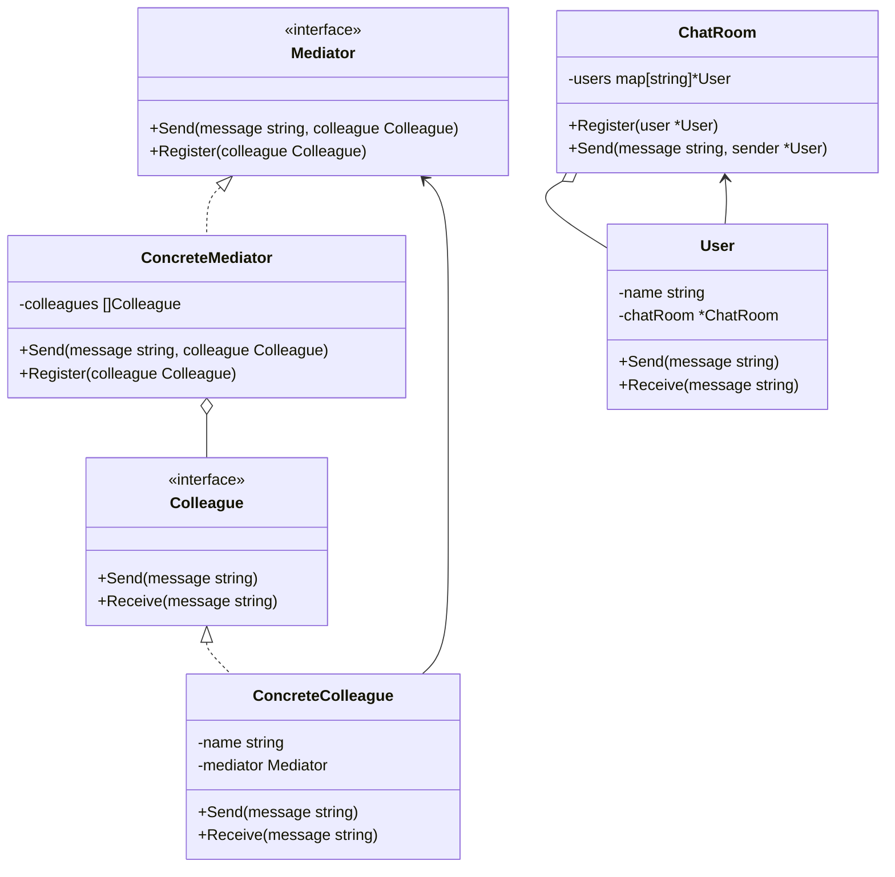

# 中介者模式（Mediator）
中介者模式用于降低多个对象和类之间的通信复杂性。这种模式提供了一个中介者类，该类通常处理不同类之间的通信，并支持松耦合，使代码易于维护。

## 主要解决的问题
- 如何降低对象之间的耦合度
- 如何集中管理对象之间的交互
- 如何简化复杂的网状通信结构
- 如何实现对象之间的解耦

## 应用实例
1. MVC框架中的控制器
2. 微服务的API网关
3. 消息中间件（如Kafka）
4. 机场塔台调度系统

## 使用场景
1. 通信系统
   - 聊天室服务器
   - 即时通讯平台
2. 交通管制
   - 航空管制系统
   - 智能交通系统
3. GUI交互
   - 窗口组件通信
   - 事件处理系统
4. 协调服务
   - 微服务协调
   - 工作流引擎

## 优缺点
### 优点
1. 松耦合
   - 对象之间不直接通信
   - 易于修改和扩展
2. 集中控制
   - 交互逻辑集中管理
   - 更容易调试和维护
3. 简化通信
   - 将网状结构变为星型
   - 减少了通信复杂度

### 缺点
1. 中介者膨胀
   - 中介者可能变得过于复杂
   - 维护成本增加
2. 性能影响
   - 所有通信都经过中介者
   - 可能形成性能瓶颈
3. 集中化风险
   - 中介者出问题影响整个系统
   - 需要考虑容错机制

## 代码实现

```golang
package designpattern

// Mediator 定义中介者接口
type Mediator interface {
    Send(message string, colleague Colleague)
    Register(colleague Colleague)
}

// Colleague 定义同事接口
type Colleague interface {
    Send(message string)
    Receive(message string)
}

// ConcreteMediator 具体中介者
type ConcreteMediator struct {
    colleagues []Colleague
}

func NewConcreteMediator() *ConcreteMediator {
    return &ConcreteMediator{
        colleagues: make([]Colleague, 0),
    }
}

func (m *ConcreteMediator) Register(colleague Colleague) {
    m.colleagues = append(m.colleagues, colleague)
}

func (m *ConcreteMediator) Send(message string, sender Colleague) {
    for _, colleague := range m.colleagues {
        // 不要发送给自己
        if colleague != sender {
            colleague.Receive(message)
        }
    }
}

// ConcreteColleague 具体同事类
type ConcreteColleague struct {
    name     string
    mediator Mediator
}

func NewConcreteColleague(name string, mediator Mediator) *ConcreteColleague {
    colleague := &ConcreteColleague{
        name:     name,
        mediator: mediator,
    }
    mediator.Register(colleague)
    return colleague
}

func (c *ConcreteColleague) Send(message string) {
    fmt.Printf("%s sends: %s\n", c.name, message)
    c.mediator.Send(message, c)
}

func (c *ConcreteColleague) Receive(message string) {
    fmt.Printf("%s receives: %s\n", c.name, message)
}

// 实际应用示例：聊天室系统
type ChatRoom struct {
    users map[string]*User
}

func NewChatRoom() *ChatRoom {
    return &ChatRoom{
        users: make(map[string]*User),
    }
}

func (c *ChatRoom) Register(user *User) {
    c.users[user.name] = user
}

func (c *ChatRoom) Send(message string, sender *User) {
    for name, user := range c.users {
        if name != sender.name {
            user.Receive(fmt.Sprintf("From %s: %s", sender.name, message))
        }
    }
}

type User struct {
    name     string
    chatRoom *ChatRoom
}

func NewUser(name string, chatRoom *ChatRoom) *User {
    user := &User{
        name:     name,
        chatRoom: chatRoom,
    }
    chatRoom.Register(user)
    return user
}

func (u *User) Send(message string) {
    fmt.Printf("%s sends: %s\n", u.name, message)
    u.chatRoom.Send(message, u)
}

func (u *User) Receive(message string) {
    fmt.Printf("%s receives: %s\n", u.name, message)
}
```

## 使用示例

```golang
func main() {
    // 基本示例
    mediator := NewConcreteMediator()
    
    colleague1 := NewConcreteColleague("Colleague1", mediator)
    colleague2 := NewConcreteColleague("Colleague2", mediator)
    colleague3 := NewConcreteColleague("Colleague3", mediator)
    
    colleague1.Send("Hello from Colleague1")
    
    // 聊天室示例
    chatRoom := NewChatRoom()
    
    alice := NewUser("Alice", chatRoom)
    bob := NewUser("Bob", chatRoom)
    charlie := NewUser("Charlie", chatRoom)
    
    alice.Send("Hi everyone!")
    bob.Send("Hey Alice!")
}
```

## 类图


## 说明
1. 中介者模式的主要角色：
   - Mediator（中介者）：定义了各个同事对象之间的交互接口
   - ConcreteMediator（具体中介者）：实现中介者接口，协调各个同事对象
   - Colleague（同事）：定义了同事类的接口
   - ConcreteColleague（具体同事）：实现同事接口，通过中介者与其他同事通信
2. 中介者模式的优点：
   - 降低了对象之间的耦合性
   - 将对象之间的交互集中到一个中介者对象
   - 使对象之间的关系变得简单
3. 适用场景：
   - 对象之间存在复杂的通信方式
   - 一组对象以定义良好但复杂的方式进行通信
   - 想定制一个分布在多个类中的行为，而又不想生成太多的子类
4. 注意事项：
   - 中介者可能会变得过于复杂
   - 需要权衡对象之间的耦合度和中介者的复杂度 