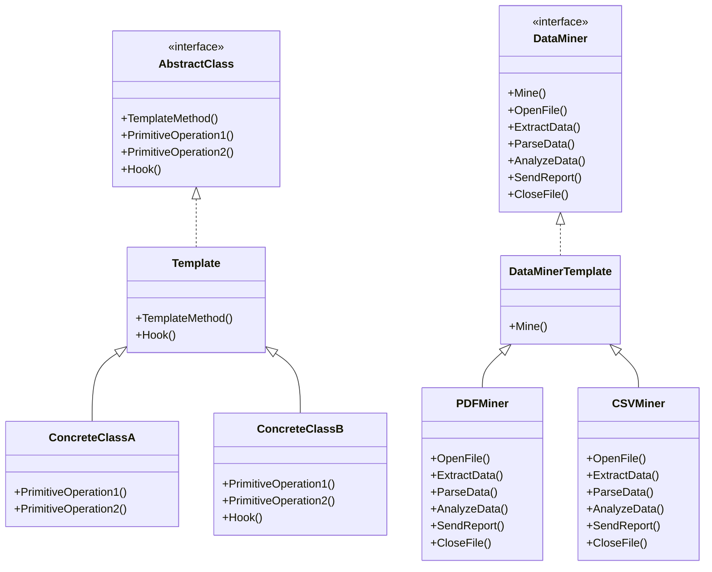

# 模板方法模式（Template Method）
模板方法模式定义了一个算法的骨架，而将一些步骤延迟到子类中实现。模板方法使得子类可以不改变一个算法的结构即可重定义该算法的某些特定步骤。

## 示例
1. 数据库访问框架
2. Web应用程序生命周期
3. 构建工具的构建过程
4. 测试框架的执行流程

## 代码实现

```golang
package designpattern

// AbstractClass 定义抽象类
type AbstractClass interface {
    TemplateMethod()
    PrimitiveOperation1()
    PrimitiveOperation2()
    Hook()
}

// Template 提供模板方法的基础实现
type Template struct {
    AbstractClass
}

// TemplateMethod 定义算法骨架
func (t *Template) TemplateMethod() {
    t.AbstractClass.PrimitiveOperation1()
    t.AbstractClass.PrimitiveOperation2()
    t.AbstractClass.Hook()
}

// Hook 提供默认实现
func (t *Template) Hook() {
    // 默认为空实现，子类可以选择性重写
}

// ConcreteClassA 具体实现A
type ConcreteClassA struct {
    Template
}

func NewConcreteClassA() *ConcreteClassA {
    concrete := &ConcreteClassA{}
    concrete.AbstractClass = concrete
    return concrete
}

func (c *ConcreteClassA) PrimitiveOperation1() {
    fmt.Println("ConcreteClassA: PrimitiveOperation1")
}

func (c *ConcreteClassA) PrimitiveOperation2() {
    fmt.Println("ConcreteClassA: PrimitiveOperation2")
}

// ConcreteClassB 具体实现B
type ConcreteClassB struct {
    Template
}

func NewConcreteClassB() *ConcreteClassB {
    concrete := &ConcreteClassB{}
    concrete.AbstractClass = concrete
    return concrete
}

func (c *ConcreteClassB) PrimitiveOperation1() {
    fmt.Println("ConcreteClassB: PrimitiveOperation1")
}

func (c *ConcreteClassB) PrimitiveOperation2() {
    fmt.Println("ConcreteClassB: PrimitiveOperation2")
}

func (c *ConcreteClassB) Hook() {
    fmt.Println("ConcreteClassB: Hook")
}

// 实际应用示例：数据处理框架
type DataMiner interface {
    Mine()
    OpenFile()
    ExtractData()
    ParseData()
    AnalyzeData()
    SendReport()
    CloseFile()
}

// DataMinerTemplate 提供基础实现
type DataMinerTemplate struct {
    DataMiner
}

func (d *DataMinerTemplate) Mine() {
    d.DataMiner.OpenFile()
    d.DataMiner.ExtractData()
    d.DataMiner.ParseData()
    d.DataMiner.AnalyzeData()
    d.DataMiner.SendReport()
    d.DataMiner.CloseFile()
}

// PDFMiner PDF文件处理器
type PDFMiner struct {
    DataMinerTemplate
}

func NewPDFMiner() *PDFMiner {
    miner := &PDFMiner{}
    miner.DataMiner = miner
    return miner
}

func (p *PDFMiner) OpenFile() {
    fmt.Println("Opening PDF file")
}

func (p *PDFMiner) ExtractData() {
    fmt.Println("Extracting data from PDF")
}

func (p *PDFMiner) ParseData() {
    fmt.Println("Parsing PDF data")
}

func (p *PDFMiner) AnalyzeData() {
    fmt.Println("Analyzing PDF data")
}

func (p *PDFMiner) SendReport() {
    fmt.Println("Sending PDF report")
}

func (p *PDFMiner) CloseFile() {
    fmt.Println("Closing PDF file")
}

// CSVMiner CSV文件处理器
type CSVMiner struct {
    DataMinerTemplate
}

func NewCSVMiner() *CSVMiner {
    miner := &CSVMiner{}
    miner.DataMiner = miner
    return miner
}

func (c *CSVMiner) OpenFile() {
    fmt.Println("Opening CSV file")
}

func (c *CSVMiner) ExtractData() {
    fmt.Println("Extracting data from CSV")
}

func (c *CSVMiner) ParseData() {
    fmt.Println("Parsing CSV data")
}

func (c *CSVMiner) AnalyzeData() {
    fmt.Println("Analyzing CSV data")
}

func (c *CSVMiner) SendReport() {
    fmt.Println("Sending CSV report")
}

func (c *CSVMiner) CloseFile() {
    fmt.Println("Closing CSV file")
}
```

## 使用示例

```golang
func main() {
    // 基本示例
    classA := NewConcreteClassA()
    classA.TemplateMethod()
    
    classB := NewConcreteClassB()
    classB.TemplateMethod()
    
    // 数据处理示例
    pdfMiner := NewPDFMiner()
    pdfMiner.Mine()
    
    csvMiner := NewCSVMiner()
    csvMiner.Mine()
}
```

## 类图


## 说明
1. 模板方法模式的主要角色：
   - AbstractClass（抽象类）：定义抽象的原语操作，实现一个模板方法
   - ConcreteClass（具体类）：实现原语操作以完成算法中特定步骤
2. 模板方法模式的优点：
   - 封装不变部分，扩展可变部分
   - 提取公共代码，便于维护
   - 行为由父类控制，子类实现
3. 适用场景：
   - 一次性实现一个算法的不变部分
   - 各子类中公共的行为应被提取出来并集中到一个公共父类中
   - 控制子类扩展
4. 注意事项：
   - 为防止恶意操作，一般模板方法都加上 final 关键字
   - 需要考虑适当的粒度来控制父类与子类之间的关系
</code_block_to_apply_changes_from>
