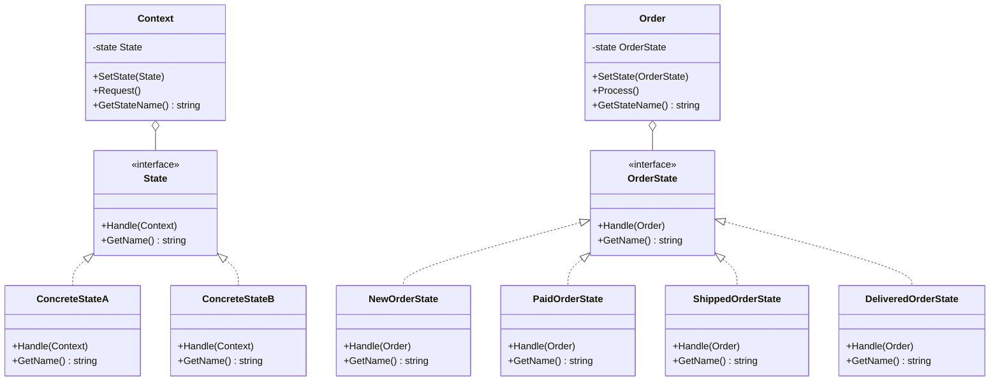

# 状态模式（State）
状态模式允许一个对象在其内部状态改变时改变它的行为。对象看起来似乎修改了它的类。这种模式将状态封装成独立的类，并将动作委托到代表当前状态的对象。

## 主要解决的问题
- 如何管理对象的状态转换
- 如何避免大量的条件判断
- 如何使状态转换更加明确
- 如何让状态对象和上下文对象解耦

## 应用实例
1. TCP连接的状态管理
2. 订单状态流转
3. 游戏角色状态
4. 工作流引擎

## 使用场景
1. 状态机实现
   - 有限状态机
   - 工作流引擎
   - 流程控制
2. 业务流程
   - 订单处理
   - 审批流程
   - 任务状态
3. 系统状态
   - 连接状态
   - 会话管理
   - 资源状态
4. 界面交互
   - 按钮状态
   - 表单状态
   - 动画状态

## 优缺点
### 优点
1. 封装性好
   - 状态逻辑集中
   - 状态转换显式
2. 扩展性强
   - 易于添加新状态
   - 符合开闭原则
3. 职责明确
   - 状态独立管理
   - 逻辑清晰

### 缺点
1. 类数量增加
   - 状态类膨胀
   - 维护成本高
2. 状态转换复杂
   - 转换逻辑分散
   - 调试困难
3. 性能问题
   - 对象创建开销
   - 状态切换开销

## 代码实现

```golang
package designpattern

// State 定义状态接口
type State interface {
    Handle(context *Context)
    GetName() string
}

// Context 定义上下文
type Context struct {
    state State
}

func NewContext() *Context {
    return &Context{state: &ConcreteStateA{}}
}

func (c *Context) SetState(state State) {
    c.state = state
}

func (c *Context) Request() {
    c.state.Handle(c)
}

func (c *Context) GetStateName() string {
    return c.state.GetName()
}

// ConcreteStateA 具体状态A
type ConcreteStateA struct{}

func (s *ConcreteStateA) Handle(context *Context) {
    fmt.Println("Handling state A, transitioning to B")
    context.SetState(&ConcreteStateB{})
}

func (s *ConcreteStateA) GetName() string {
    return "State A"
}

// ConcreteStateB 具体状态B
type ConcreteStateB struct{}

func (s *ConcreteStateB) Handle(context *Context) {
    fmt.Println("Handling state B, transitioning to A")
    context.SetState(&ConcreteStateA{})
}

func (s *ConcreteStateB) GetName() string {
    return "State B"
}

// 实际应用示例：订单状态系统
type OrderState interface {
    Handle(order *Order)
    GetName() string
}

type Order struct {
    state OrderState
}

func NewOrder() *Order {
    return &Order{state: &NewOrderState{}}
}

func (o *Order) SetState(state OrderState) {
    o.state = state
}

func (o *Order) Process() {
    o.state.Handle(o)
}

func (o *Order) GetStateName() string {
    return o.state.GetName()
}

// NewOrderState 新订单状态
type NewOrderState struct{}

func (s *NewOrderState) Handle(order *Order) {
    fmt.Println("Processing new order, transitioning to paid")
    order.SetState(&PaidOrderState{})
}

func (s *NewOrderState) GetName() string {
    return "New Order"
}

// PaidOrderState 已支付状态
type PaidOrderState struct{}

func (s *PaidOrderState) Handle(order *Order) {
    fmt.Println("Processing paid order, transitioning to shipped")
    order.SetState(&ShippedOrderState{})
}

func (s *PaidOrderState) GetName() string {
    return "Paid"
}

// ShippedOrderState 已发货状态
type ShippedOrderState struct{}

func (s *ShippedOrderState) Handle(order *Order) {
    fmt.Println("Processing shipped order, transitioning to delivered")
    order.SetState(&DeliveredOrderState{})
}

func (s *ShippedOrderState) GetName() string {
    return "Shipped"
}

// DeliveredOrderState 已送达状态
type DeliveredOrderState struct{}

func (s *DeliveredOrderState) Handle(order *Order) {
    fmt.Println("Order has been delivered, no further transitions")
}

func (s *DeliveredOrderState) GetName() string {
    return "Delivered"
}
```

## 使用示例

```golang
func main() {
    // 基本示例
    context := NewContext()
    fmt.Println("Current state:", context.GetStateName())
    
    context.Request()
    fmt.Println("Current state:", context.GetStateName())
    
    context.Request()
    fmt.Println("Current state:", context.GetStateName())
    
    // 订单状态示例
    order := NewOrder()
    fmt.Println("Order state:", order.GetStateName())
    
    order.Process() // New -> Paid
    fmt.Println("Order state:", order.GetStateName())
    
    order.Process() // Paid -> Shipped
    fmt.Println("Order state:", order.GetStateName())
    
    order.Process() // Shipped -> Delivered
    fmt.Println("Order state:", order.GetStateName())
}
```

## 类图


## 说明
1. 状态模式的主要角色：
   - State（状态）：定义一个接口以封装状态对应的行为
   - ConcreteState（具体状态）：实现状态对应的行为
   - Context（上下文）：维护一个State实例
   - StateFactory（状态工厂）：管理状态实例
2. 实现要点：
   - 状态转换的触发机制
   - 状态对象的生命周期
   - 状态数据的传递
3. 设计考虑：
   - 是否需要状态共享
   - 是否需要历史状态
   - 是否需要状态栈
4. 相关模式：
   - 策略模式：不同的算法
   - 单例模式：状态对象共享
   - 备忘录模式：保存状态
</rewritten_file>
