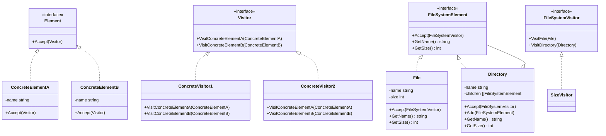

# 访问者模式（Visitor）
访问者模式是一种将算法与对象结构分离的设计模式。这种模式的基本思想是在不改变数据结构的前提下定义作用于这些元素的新的操作。

## 主要解决的问题
- 如何在不改变数据结构的情况下添加新操作
- 如何分离数据结构和数据操作
- 如何让操作集中管理
- 如何支持双重分派

## 应用实例
1. 编译器的AST处理
2. 文件系统遍历器
3. 文档对象模型访问
4. 代码生成工具

## 使用场景
1. 复杂对象结构
   - 抽象语法树
   - 文件系统
   - 组合对象
2. 数据处理
   - 报表生成
   - 数据导出
   - 统计分析
3. 结构转换
   - 格式转换
   - 代码生成
   - 结构优化
4. 操作扩展
   - 插件系统
   - 功能扩展
   - 动态更新

## 优缺点
### 优点
1. 符合单一职责
   - 相关操作集中
   - 职责明确
2. 扩展性好
   - 易于增加操作
   - 不修改现有代码
3. 灵活性高
   - 支持双重分派
   - 操作和数据分离

### 缺点
1. 违反依赖倒置
   - 依赖具体类
   - 破坏封装
2. 复杂度高
   - 结构复杂
   - 理解困难
3. 维护成本
   - 类数量增多
   - 修改困难

## 代码实现

```golang
package designpattern

// Element 定义元素接口
type Element interface {
    Accept(visitor Visitor)
}

// Visitor 定义访问者接口
type Visitor interface {
    VisitConcreteElementA(element *ConcreteElementA)
    VisitConcreteElementB(element *ConcreteElementB)
}

// ConcreteElementA 具体元素A
type ConcreteElementA struct {
    name string
}

func NewConcreteElementA(name string) *ConcreteElementA {
    return &ConcreteElementA{name: name}
}

func (e *ConcreteElementA) Accept(visitor Visitor) {
    visitor.VisitConcreteElementA(e)
}

// ConcreteElementB 具体元素B
type ConcreteElementB struct {
    name string
}

func NewConcreteElementB(name string) *ConcreteElementB {
    return &ConcreteElementB{name: name}
}

func (e *ConcreteElementB) Accept(visitor Visitor) {
    visitor.VisitConcreteElementB(e)
}

// ConcreteVisitor1 具体访问者1
type ConcreteVisitor1 struct{}

func (v *ConcreteVisitor1) VisitConcreteElementA(element *ConcreteElementA) {
    fmt.Printf("Visitor1 visited ElementA: %s\n", element.name)
}

func (v *ConcreteVisitor1) VisitConcreteElementB(element *ConcreteElementB) {
    fmt.Printf("Visitor1 visited ElementB: %s\n", element.name)
}

// ConcreteVisitor2 具体访问者2
type ConcreteVisitor2 struct{}

func (v *ConcreteVisitor2) VisitConcreteElementA(element *ConcreteElementA) {
    fmt.Printf("Visitor2 visited ElementA: %s\n", element.name)
}

func (v *ConcreteVisitor2) VisitConcreteElementB(element *ConcreteElementB) {
    fmt.Printf("Visitor2 visited ElementB: %s\n", element.name)
}

// ObjectStructure 对象结构
type ObjectStructure struct {
    elements []Element
}

func (o *ObjectStructure) Attach(element Element) {
    o.elements = append(o.elements, element)
}

func (o *ObjectStructure) Accept(visitor Visitor) {
    for _, element := range o.elements {
        element.Accept(visitor)
    }
}

// 实际应用示例：文件系统访问
type FileSystemElement interface {
    Accept(visitor FileSystemVisitor)
    GetName() string
    GetSize() int
}

type FileSystemVisitor interface {
    VisitFile(file *File)
    VisitDirectory(directory *Directory)
}

type File struct {
    name string
    size int
}

func NewFile(name string, size int) *File {
    return &File{name: name, size: size}
}

func (f *File) Accept(visitor FileSystemVisitor) {
    visitor.VisitFile(f)
}

func (f *File) GetName() string { return f.name }
func (f *File) GetSize() int    { return f.size }

type Directory struct {
    name     string
    children []FileSystemElement
}

func NewDirectory(name string) *Directory {
    return &Directory{name: name}
}

func (d *Directory) Accept(visitor FileSystemVisitor) {
    visitor.VisitDirectory(d)
    for _, child := range d.children {
        child.Accept(visitor)
    }
}

func (d *Directory) Add(element FileSystemElement) {
    d.children = append(d.children, element)
}

func (d *Directory) GetName() string { return d.name }
func (d *Directory) GetSize() int {
    total := 0
    for _, child := range d.children {
        total += child.GetSize()
    }
    return total
}

// SizeVisitor 计算大小的访问者
type SizeVisitor struct {
    totalSize int
}

func (v *SizeVisitor) VisitFile(file *File) {
    v.totalSize += file.GetSize()
}

func (v *SizeVisitor) VisitDirectory(directory *Directory) {
    // 目录本身不占用空间
}

func (v *SizeVisitor) GetTotalSize() int {
    return v.totalSize
}
```

## 使用示例

```golang
func main() {
    // 基本示例
    objectStructure := &ObjectStructure{}
    objectStructure.Attach(NewConcreteElementA("A1"))
    objectStructure.Attach(NewConcreteElementB("B1"))
    
    visitor1 := &ConcreteVisitor1{}
    visitor2 := &ConcreteVisitor2{}
    
    objectStructure.Accept(visitor1)
    objectStructure.Accept(visitor2)
    
    // 文件系统示例
    root := NewDirectory("root")
    docs := NewDirectory("docs")
    root.Add(docs)
    
    file1 := NewFile("file1.txt", 100)
    file2 := NewFile("file2.txt", 200)
    docs.Add(file1)
    docs.Add(file2)
    
    sizeVisitor := &SizeVisitor{}
    root.Accept(sizeVisitor)
    fmt.Printf("Total size: %d bytes\n", sizeVisitor.GetTotalSize())
}
```

## 类图


## 说明
1. 访问者模式的主要角色：
   - Visitor（访问者）：声明访问各个元素的方法
   - ConcreteVisitor（具体访问者）：实现访问者声明的方法
   - Element（元素）：定义接受访问者的方法
   - ConcreteElement（具体元素）：实现接受访问者的方法
   - ObjectStructure（对象结构）：提供遍历元素的方法
2. 实现要点：
   - 访问者接口设计
   - 元素接口设计
   - 双分派机制实现
3. 设计考虑：
   - 是否需要访问者缓存
   - 是否需要状态维护
   - 是否需要并行访问
4. 相关模式：
   - 组合模式：构建对象结构
   - 迭代器模式：遍历元素
   - 命令模式：封装操作