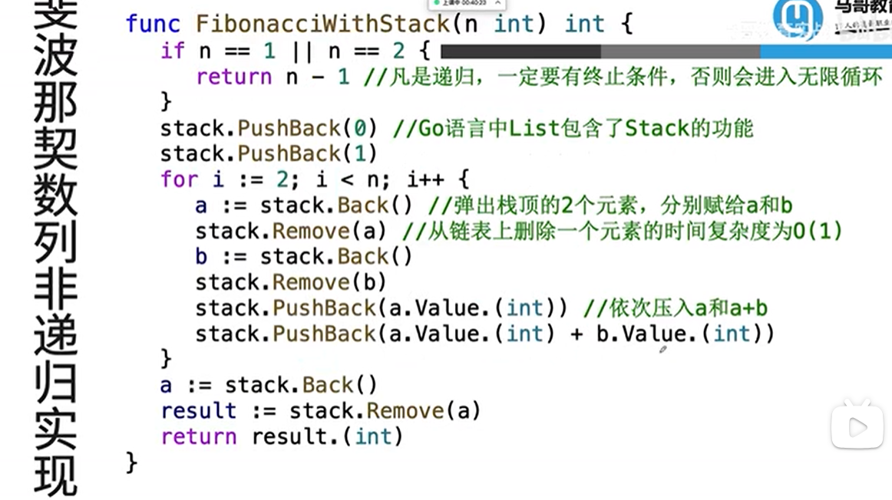

# 马哥golang面试

[【golang面试】go语言经典面试题一网打尽！（并发+算法+channel+slice）_哔哩哔哩_bilibili](https://www.bilibili.com/video/BV1EL4y1P7hh/?share_source=copy_web)

# 1. 语言优势

- 可直接编译成机械码
- 直接运行即可部署
- 强类型方便阅读和重构
- 天生支持并发，充分利用多核
- 强大标准库，搞笑GC垃圾回收

# 2. Channel

## 2.1 CSP模型

CSP：(Communicating Sequential Processes)通信顺序进程，是一种并发编程模型

golang中的map不支持并发读写。而sync.Map支持并发读写

```go
// sync.Map的使用方法
var mp sync.Map

func rwGlobalMemory(){
	// 取值
	if value, exists := mp.Load("mykey"); exists {
		fmt.Println(value)
	} else {
		// 存值
		mp.Store("mykey", "myvalue")
	}
}
```

## 2.2 协程间共享数据,协程间通信

```go
// 使用共享数据content
// bufio.NewReader 读取文件的内容
// bufio.NewWirter 写入文件内容
// 将三个文件的内容写入到同一个文件里

var (
	content = make(chan string, 1000)
	readFileCh = make(chan struct{}, 3)
	writeFileCh = make(chan struct{}, 0)
)

func readFile(infile string) {
	fin, err := os.Open(infile)
	if err != nil {
		fmt.Println(err)
	}
	defer fin.Close()

	reader:= bufio.NewReader(fin)
	for {
		line, err := reader.ReadString('\n') // 读取每一行
		if err == nil {
			content <- line
		} else {
			if err == io.EOF {  // End Of file错误
				if len(line) > 0 { // 输入文件的最后一行没有换行符
					content <- (line + "\n")
				}
				break
			} else {
				fmt.Println(err)
			}
		}
	}
	<-readFileCh
	if len(readFileCh) == 0 {
		close(content)
	}
}

func writeFile(mergedFile string) {
	fout, err := os.OpenFile(mergedFile, os.O_CREATE|os.O_TRUNC|os.O_RDWR, 0666)
	if err != nil {
		fmt.Println(err)
	}
	defer fout.Close()
	writer := bufio.NewWriter(fout) 

	// for range 遍历并取走管道里的元素，当content管道为空且被close时，for循环才会被退出
	for {
		line := <-content
		writer.WriteString(line)
	}

	writer.Flush() // 刷新写入磁盘
	
	writeFileCh <- struct{}{}
}

func main(){
	for i := 0; i < 3; i++ {
		readFileCh <- struct{}{}
	}
	go readFile("data/1.txt")
	go readFile("data/2.txt")
	go readFile("data/3.txt")

	go writeFile("data/big.txt")

	<-writeFileCh
}
```

## 2.3 channel导致死锁的问题

1. Channel满了，就阻塞写；channel空了，就阻塞读
2. 阻塞之后就会交出cpu，去执行其他协程，希望其他协程能够帮自己解除阻塞
3. 如果阻塞发生在main协程里，并且没有其他子协程可以执行，那就可以确定“希望永远等不来”，自己把自己杀掉，报一个fatal error:deadlock出来
4. 如果阻塞发生在子协程里，就不会发生死锁，因为至少main协程是一个值得等待的”希望”，会一直等（阻塞）下去

阻塞asleep 

# 3. 并发

## 3.1 资源竞争

go run或者go build 时添加 -race 参数检查资源竞争情况

n++不是原子操作，并发执行时会存在脏写情况。

## 3.2 读写锁

```go
var lock sync.RWMutex   // 申明读写锁，无需初始化
lock.Lock()         // 加写锁
lock.Unlock()       // 释放写锁
lock.RLock()        // 加读锁
lock.RUnlock()      // 释放读锁

// 任意时刻只可以加一把写锁，且不能加读锁
// 没加写锁时，可以同时加多把读锁，读锁加上之后不能再加写锁
```

## 3.3 容器的并发安全性

数组、slice、struct允许并发修改（可能会脏写），并发修改map有时会发生panic

如果需要并发修改map，请使用sync.Map

## 3.4 sync.Once

确保再高并发的场景下，有些事情只需要执行一次，比如加载配置文件、关闭管道等。单例模式

# 4. 算法

## 4.1 Ring：基于滑动窗口的统计

ring: 环，

- 最近100次的接口调用的平均耗时，最近10笔订单的平均值、最近30个交易日股票的最高点
- ring的容量即为滑动窗口的大小，把待观察变量按时间顺序不停地写入ring即可

```go
const WINDOW_SIZE = 10
ring := ring.New(WINDOW_SIZE)
ring.Next()  // 下一个数据内容
ring.Do(func(i interface{}){  // 通过Do()来遍历ring，内部实际上调用了Next()
	num := i.(int)
})
```

## 4.2 用Stack实现高效的递归

斐波那契数列

普通的使用递归来实现斐波那契数列会造成计算浪费，重复计算。

可以使用栈来解除递归




## 4.3 用Heap实现一个超时缓存


把超时的元素从缓存中删除

1. 按key的到期时间把key插入小根堆中
2. 周期扫描堆顶元素，如果他的到期时间早于当前时刻，则从堆缓存中删除，然后向下调整堆

# 5. slice避坑

## 5.1 append的性能损耗

切片

```go
type slice struct{
	array unsafe.Pointer
	len int
	cap int
}
```

**************************append操作**************************

```go
arr := make([], 3, 5)  // arr长度为3，容量为5。此时数组内容为[0, 0, 0, , ]
brr := append(arr, 8) // arr和brr共享底层数组，但是他们的len不同。此时arr和brr为[0, 0, 0, 8, ,]
```

append扩容系数

- 切片相对于数组最大的特点就是可以追加元素，可以自动扩容
- 追加的元素放到预留的内存空间里，同时len＋1
- 如果预留的空间已用完，则会重新申请一块更大的内存空间。capacity大约变成之前的2倍(cap<1024)或1.25倍(cap>1024)。并且**把原内存空间的数据拷贝过来**，再新内存空间上执行append操作
  - 所以当出现扩容操作时，用切片会特别消耗内存

## 5.2 母子切片内存共享问题

- 截取一部分，创造子切片，此时子切片与母切片共享底层内存空间，母切片的capacity子切片可能直接使用
- 母切片的capacity还允许子切片执行append操作
- 可以一次append多个元素  sub = append(sub, 6, 7)
- 母切片的capacity用完了，子切片在执行append就得申请一片新的内存，把老数据先拷贝过来，在新内存上执行append操作。

```go
func sub(){
	arr := make([]int, 5)
  arr = append(arr, 1, 2, 3) // arr=[1,2,3]
  sub := arr[1:3]  // sub=[2,3] sub.cap=4
  sub = append(sub, 4, 5) // arr=[1,2,3,4,5] sub=[2,3,4,5]
  sub[0] = 8  // arr=[1,8,3,4,5] sub=[8,3,4,5]
	sub = append(sub, 10)  // arr=[1,8,3,4,5]  sub=[8,3,4,5,10] sub.cap=10
  sub[0]= 1  // arr=[1,8,3,4,5] sub=[1,3,4,5,10]
}
```

## 5.3 切片导致的内存泄漏

内存泄漏：内存没有按照预期被回收。有内存申请没释放。

```go
func return_sub_slice() []int {
	// parent切片持有一个长度为1M的int数组，共占内存8M
	TOTAL := 1 << 20
	parent := make([]int, TOTAL)
	// 只要child没被GC回收，长度为1M的int 数组就一直得不到释放
	child := parent[2:7]
	// child仍然持有底层的那个大数组
  return child
}
```

## 5.4 函数参数需要用切片指针吗

```go
func changSlice(arr *[]int){
	// len和cap要变，需要传切片指针
	*arr = append(*arr, 9)
	// len\pointer和cap要变，需要传切片指针
	*arr = (*arr)[1:2]
	// slice结构体的3个Field都不变，只变底层数组，不需要传切片指针
  (*arr)[0] = 9
}
```

## 5.5 一边遍历一边修改切片

```go
arr := []int{1,2,3]
// for range取得的是集合中元素的拷贝
for _, ele := range arr{
	ele = ele +1
} 
// 这个执行才有效，arr才会改变
for i,ele := range arr{
	arr[i] = ele + 1
}
```