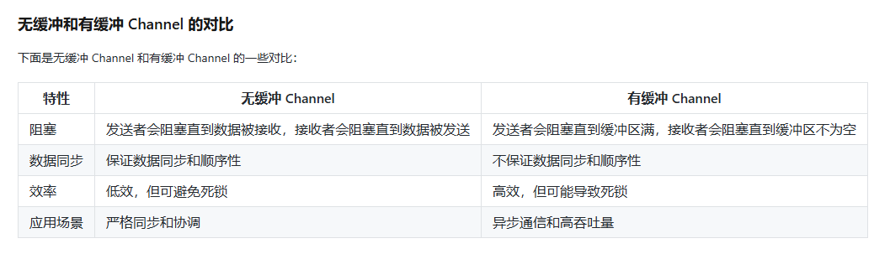
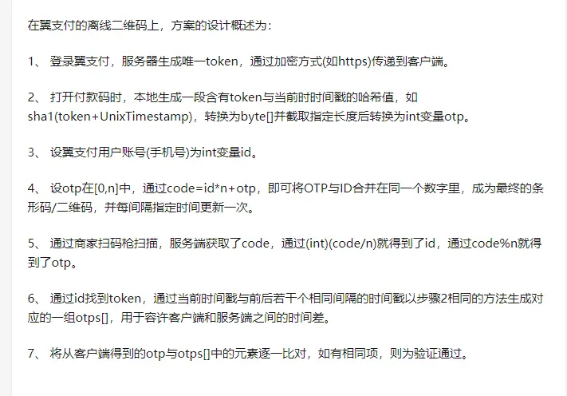

### 判断运算结果是否产生溢出
#### 无符号数判断
判断方法：最高位向前是否有进位或错位！如果有，则溢出。
#### 有符号数判断
判断方法：最高位的进（借）位状态和次高位的进（借）位状态的异或结果。
结果为 1，则溢出；结果为 0，则不溢出。

### 值传递和引用传递
值传递：值传递是传值，函数调用时，将参数的值复制一份给函数的形参。
引用传递：引用传递是传地址，函数调用时，将参数的地址复制一份给函数的形参。

### make 和 new 有什么区别？
make 一般用来创建引用类型 slice、map 以及 channel 等等，并且是非零值的。而 new 用于类型的内存分配，并且内存置为零。make 返回的是引用类型本身；而 new 返回的是指向类型的指针。

### slice 和 array 有区别吗？
slice， 是切片，是引用类型，长度可变。
array，是数组，是值类型，长度不可变。

## 并发编程

### 什么是 Channel？
在 Go 语言中，Channel 是一种特殊的数据结构，它可以在 Goroutine 之间进行通信和同步。Channel 可以看作是一个队列，其中 Goroutine 可以向 Channel 发送消息或从 Channel 接收消息。通过 Channel，不同的 Goroutine 可以安全地传递数据，并保证数据的**同步和顺序性**。

### Go 语言当中 Channel（通道）有什么特点，需要注意什么？
如果给一个 nil 的 channel 发送数据，会造成永远阻塞。
如果从一个 nil 的 channel 中接收数据，也会造成永久阻塞。
给一个已经关闭的 channel 发送数据， 会引起 panic
从一个已经关闭的 channel 接收数据， 如果缓冲区中为空，则返回一个零
值。

### Go 语言当中 Channel 缓冲有什么特点？
无缓冲的 channel 是同步的，而有缓冲的 channel 是非同步的。

### 支付过程为什么不是同步的？
支付过程是异步的，因为支付过程需要调用第三方接口，第三方接口可能返回失败，也可能返回成功，但是这个过程是异步的。

### 离线支付原理
离线支付原理和Google Authoritazation生成动态口令原理相似
- Google Authoritazation 生成动态口令原理：客户端和服务端都会保存一个密钥，当使用动态口令的时候，客户端会通过保存的密钥加上一定的时间差值进行加密算法生成动态口令码，验证时，服务器会根据这个客户的密钥去进行算法生成动态口令，然后和客户端传过来的动态口令进行比较。 
- 支付时的密钥采用动态密钥的方式
