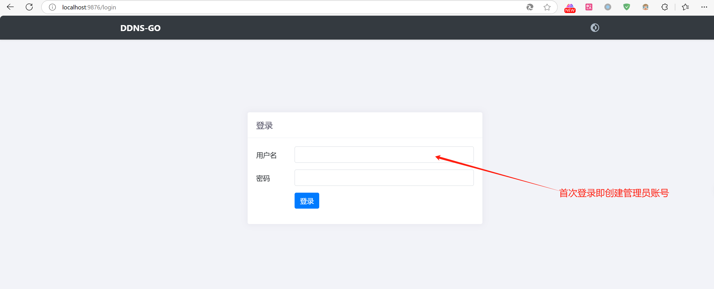
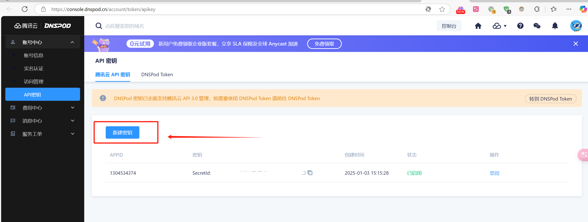
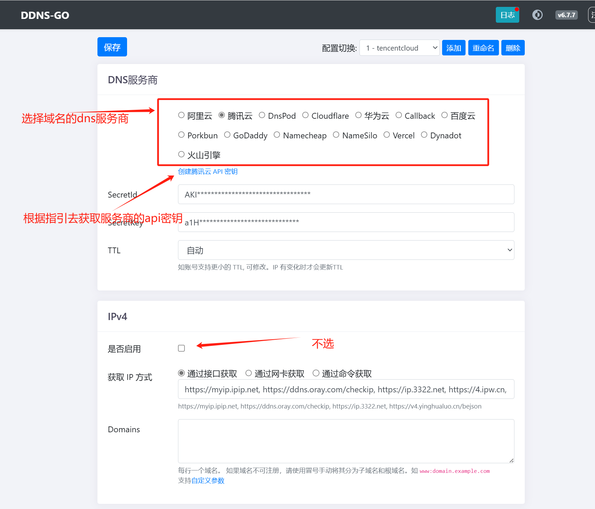
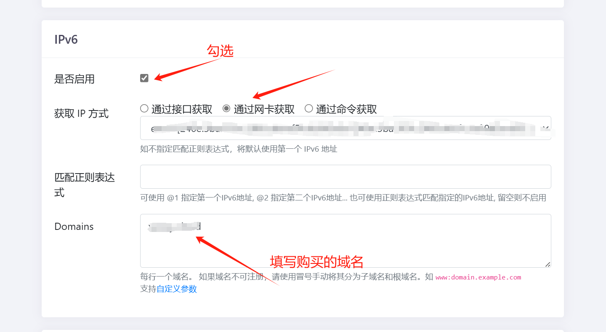
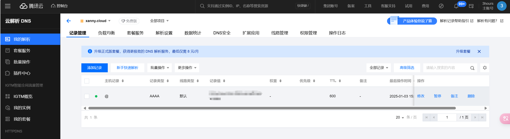

# 内网服务器ipv6地址动态解析映射到域名

## 1. 首先需要自己的域名，并且域名解析服务商支持ipv6解析
随便在哪个域名解析服务商注册一个域名，比如阿里云，腾讯云，华为云，百度云等，购买一个喜欢的域名即可

## 2. 设置DDNS-go 

参考[DDNS-go](https://github.com/jeessy2/ddns-go) 文档，设置DDNS-go ，将域名解析到内网服务器的ipv6地址

在服务器中直接搭建一个ddns-go服务

挂载主机目录, 使用docker host模式。可把 /opt/ddns-go 替换为你主机任意目录, 配置文件为隐藏文件

`
docker run -d --name ddns-go --restart=always --net=host -v /opt/ddns-go:/root jeessy/ddns-go
`

在浏览器中打开http://主机IP:9876，并修改你的配置

### 登录

### 创建服务商api密钥

### 选择服务商

### ipv6设置

完成以上操作后保存就可以了。
保存完之后，ddns-go会自动解析域名到内网服务器的ipv6地址。会在你的域名解析服务商的控制台中看到解析记录。

## 3. 服务器内开启防火墙端口

最后，最重要的一步就是在你的服务器上开启防火墙端口，否则无法访问。

`sudo ip6tables -I INPUT -p tcp --dport 18000 -j ACCEPT`

`sudo ip6tables -I FORWARD -p tcp --dport 18000 -j ACCEPT`

----

> 参考资料：
> 
> github: https://github.com/jeessy2/ddns-go
> 
> 博客: https://post.smzdm.com/p/awzpd9lp/
