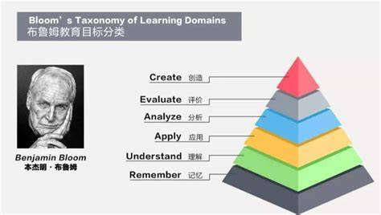

教育心理学家本杰明·布鲁姆（Benjamin Bloom）于1956年提出的一种教育目标分类系统，2001年，Anderson 和 Krathwohl 对布鲁姆分类法进行了修订。

布鲁姆分类法将认知目标划分为六个层次，按照认知复杂性递增的顺序排列，包括以下内容：

1）记忆（Remember）：指记忆过去学习的内容，如事实、方法、过程和理论。要求能够回忆出具体的知识点，是认知学习的最低层次。

2）理解（Understand）：指能理解材料的意义并加以阐述。表现为三种方式：转换（用自己的话表达）、解释（说明或概述信息）、推断（估计未来趋势）。理解超越了简单记忆，是认知学习的基本层次。

3）应用（Apply）：指能将习得的材料应用于新的具体情境，包括概念、规则、方法、规律和理论的应用。代表高水平的理解。在这个层次，需要将所学的知识应用于实际情境中，解决问题，进行实际操作或演示技能。

4）分析（Analyze）：在这个层次，需要分解和分析信息，识别其组成部分、关系和模式。这是比应用更高的认知水平，涉及理解材料的内容与结构。

5）评价（Evaluate）：在这个层次，需要评估和判断信息的可靠性、有效性和合理性。要求根据证据或标准对信息、观点、作品等进行深入评估。

6）创造（Create）：在这个层次，需要生成新的想法、概念、解决方案或产品，进行设计、发明、撰写等创造性的活动。

